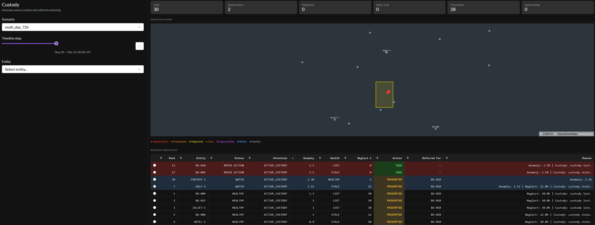

# Custody

**Closed-loop maritime ISR reasoning system**

Custody screens vessel populations, detects anomalous behavior using ML and heuristic signals, and converts that detection into prioritized, sensor-aware collection decisions — with a full reasoning chain behind every recommendation.


---

## The Problem

Maritime surveillance generates far more targets than sensors can observe. An analyst watching 30 vessels needs to answer three questions every hour:

1. Which vessels are actually behaving unusually?
2. How confident should I be in that assessment?
3. What should I collect next, with which sensor, and why?

Most anomaly detection systems answer the first question and stop. Custody answers all three — and feeds collection outcomes back into the next decision cycle.

---

## How It Works

Custody operates as a closed loop. Each stage feeds the next, and collection outcomes update future decisions.

| Stage | What it does |
|-------|-------------|
| **Observe** | Ingest AIS tracks, maintain per-vessel behavioral baselines |
| **Detect** | Score anomalies via ML (Isolation Forest on real NOAA AIS data) and heuristic detectors (zone proximity, loitering, route deviation, vessel proximity) |
| **Reason** | Evaluate ML/heuristic agreement, track persistence, model state transitions (emerging → confirmed → sustained → recovering), compute confidence across history depth, sensor suitability, and custody strength |
| **Prioritize** | Rank the fleet by fused anomaly severity, adjusted for confidence |
| **Task** | Assign monitoring tier, revisit cadence, and sensor preference — respecting EO/SAR constraints, solar conditions, and swath coverage |
| **Collect** | Execute collection; success resets uncertainty, failure increases urgency and biases the next cycle toward retasking |

---

## What Makes It Different

**Per-vessel normalization.** The ML model learns each vessel's baseline. A fishing boat accelerating from 2 to 12 km/h is as notable as a cargo ship doing 35 knots. Detection adapts to the vessel, not a global threshold.

**Temporal reasoning.** A one-hour spike is not treated the same as a six-hour sustained anomaly. The system tracks agreement between ML and heuristic signals, requires persistence before escalating, and models explicit state transitions with recovery tracking.

**Sensor-aware tasking.** The system doesn't recommend optical imaging at night. It selects EO or SAR based on solar conditions, suggests cross-sensor confirmation when only one modality has observed the anomaly, and computes swath footprints so one collection can cover multiple nearby targets.

**Confidence-gated escalation.** Thin evidence shifts the system toward confirmation rather than aggressive action. Custody degradation alone — which happens to every vessel over time — does not trigger escalation. Brief spikes do not promote to top tiers. Escalation requires persistent, multi-source evidence.

**Closed-loop feedback.** Collection outcomes are not discarded. A failed attempt increases urgency and biases the next cycle toward retasking. A successful collection resets the loop.

---

## Selective Custody

Custody does not attempt to maintain persistent tracking on every vessel. That approach fails at scale.

Instead, the system screens the full population and selectively commits resources to the subset of targets that matter:

| Attention tier | When assigned | Neglect pressure |
|---|---|---|
| **Background** | Routine traffic — no behavioral signal, no zone relevance | None |
| **Watchlist** | Elevated interest — mild anomaly, zone proximity, or degrading custody | Reduced |
| **Active Custody** | Active tracking — high anomaly, zone entry, weak confidence, or operator directive | Full |

Only Active Custody and Watchlist entities accrue meaningful neglect pressure. A background vessel going unobserved for 100 hours does not crowd out a newly promoted target.

---

## Tuned Behavior

The system was explicitly tuned to behave like a disciplined ISR operator: observe broadly, escalate selectively, act rarely.

| Tasking tier | Distribution | Meaning |
|---|---|---|
| Routine | ~81% | Correctly ignored |
| Elevated | ~16% | Increased monitoring for mild anomalies |
| Priority | ~2% | Persistent, multi-source, high-confidence anomalies |
| Urgent | Rare | Sustained anomaly with confirmed state and weak custody |

Design principles enforced by tuning:
- Custody degradation alone does not trigger escalation
- Heuristic-only signals do not escalate without ML persistence or agreement
- Brief anomaly spikes do not promote to priority
- Weak custody only raises tier when combined with confirmed anomaly state

---

## Key Behaviors

**Rendezvous detection.** Pairwise and sequence-based — the system detects vessel proximity, tracks the converge → dwell → separate sequence, and distinguishes genuine rendezvous from transient crossing.

**Dark-vessel handling.** When AIS drops, position freezes at last-known, uncertainty grows over time, and custody health degrades from HEALTHY through STALE to LOST. Manually directed vessels maintain their attention tier even after going dark.

**Manual tracking directives.** Operators can designate a vessel for persistent Active Custody regardless of anomaly score. The directive sets an attention-tier floor; the vessel still competes for sensors on merit rather than consuming them unconditionally.

**Preemption tradeoffs.** When one entity is serviced and another cannot be, the system records who was deferred, for whom, and why. Preemption is a first-class event, not a silent drop.

**Observation-aware tasking.** The system tracks which sensor last observed a target and how recently, then adjusts collection intent: search (stale), confirm (recent anomaly with low confidence), characterize (sustained high-confidence anomaly), or monitor (routine).

---

## Demo Scenario

The default demo runs 24 vessels over 36 hours with four scripted actors:

| Entity | Role | Behavior arc |
|---|---|---|
| `BRAVO-1` | Zone loiterer | Approaches ZONE_ALPHA ~h15, loiters h16–28, evasive egress |
| `ECHO-1/2` | Rendezvous pair | Converge from opposite sides, dwell ~h12–22, separate |
| `PORT-1` | Manual custody / dark | Slow transit under MAINTAIN_CUSTODY, AIS dropout at h12 |
| Background ×20 | Mixed archetypes | Transit, patrol, approach — realistic population |

**Narrative arc:**
- **h0–11**: Fleet is quiet. All vessels routine. PORT-1 tracked under operator directive.
- **h12**: PORT-1 AIS dropout and ECHO rendezvous fire simultaneously — direct portfolio tradeoff.
- **h12–22**: Dark-vessel concern, active rendezvous, and BRAVO-1 zone loitering all compete for sensor capacity.
- **h22+**: ECHO pair separates, PORT-1 track degrades, BRAVO-1 evasive egress. Fleet returns to routine.

The system also supports a **72-hour multi-day scenario** with 30 entities, 6 scripted actors, condition-triggered phase transitions, and a three-act narrative arc.



---

## Technology

| Component | Detail |
|-----------|--------|
| Engine | Python 3.12+, deterministic simulation, 72-hour multi-day scenarios |
| ML | scikit-learn Isolation Forest, trained on 300 vessels × 10 days of NOAA AIS data |
| AIS data | Real NOAA AIS daily CSVs, preprocessed to hourly cadence |
| Orbital model | SGP4 propagation, 6 synthetic satellites with real TLE-based pass windows |
| UI | Dash (portfolio table, pydeck map, entity reasoning panels, decision traces) + Streamlit (legacy) |
| Tests | ~2,000 passing, covering detection through UI callbacks |

---

## Quickstart

```bash
uv sync
# Dash UI (current)
uv run python src/app/dash_app.py
# Streamlit UI (legacy)
uv run streamlit run src/app/streamlit_app.py
```

Requires Python ≥ 3.12 and [uv](https://docs.astral.sh/uv/).

---

## Running Tests

```bash
uv run pytest tests/
```

---

## Repository Structure

```
src/
  custody/
    ais.py                  AIS CSV ingestion and single-vessel replay
    alerts.py               Sparse event-style alert layer
    anomalies.py            Composite anomaly scorer
    behavior/               Atomic behavior detectors and state machine
    collection.py           Collection attempt and uncertainty reduction
    compounds.py            Multi-signal compound behavioral patterns
    confidence.py           Confidence / uncertainty modeling
    config.py               All thresholds, zone geometry, sensor constants
    decision.py             Mission reasoning layer
    decision_trace.py       Structured planner decision breakdown
    features/               Motion, zone, and proximity feature extractors
    fusion.py               Multi-source evidence fusion
    models.py               Shared dataclasses (TrackState, Vessel, Zone)
    observation.py          Observation state and cross-sensor reasoning
    orbit.py                TLE parsing, SGP4 propagation, satellite visibility
    planner.py              Collection planner (HOLD/TASK/PREEMPTED gate)
    reasoning.py            Temporal anomaly reasoning (agreement, persistence, escalation)
    sensors.py              Orbital and schedule-based sensor catalog
    solar.py                Solar position and sensor suitability
    swath.py                Sensor footprint geometry and grouped collection value
    tasking_policy.py       Adaptive tasking policy (tier, revisit, sensor, action)
    taskrecommendation.py   Collection orchestration → ranked task queue
    tracks.py               Track position update and uncertainty decay
    whatif.py               Config-variant comparison engine
    prediction/             Forward trajectory, zone-crossing probability, anomaly forecast
    orchestration/          Attention tier classification and portfolio ranking
    simulation/             Multi-target simulation engine with trigger-based phases
    ingest/                 NOAA AIS preprocessing pipeline
    ml/                     ML anomaly scoring, features, normalization, analysis,
                            injection testing, priority scoring
  app/
    dash_app.py             Dash application entrypoint
    adapter.py              Engine-to-UI adapter layer
    state.py                Dash store definitions and server-side cache
    layout/                 Dash layout modules (sidebar, overview, map, entity detail)
    callbacks/              Dash callback modules (navigation, portfolio, map, entity detail)
    streamlit_app.py        Legacy Streamlit dashboard
    portfolio_overview.py   Portfolio table, KPI counts, display status
    overview_filters.py     Status/tier/top-N filter helpers
    overview_events.py      Event feed detectors
    entity_detail_panel.py  Fusion → Decision → Task Queue panel (Streamlit)
    entity_detail_data.py   Pure data helpers for entity detail display
    compound_panels.py      Compound signal display helpers
    orbital_passes_panel.py Orbital pass reference table
    whatif_panel.py         What-if results display
    ground_track.py         Orbital ground-track sampling
scripts/                    Training, scoring, analysis, preprocessing scripts
models/                     Trained Isolation Forest artifact
data/                       Preprocessed AIS parquet files
tests/                      ~2,000 tests
```

---

## Future Directions

- Real-time AIS feed integration
- Orbital access modeling from live TLEs
- Multi-INT fusion beyond AIS + overhead
- Reinforcement learning for tasking optimization
