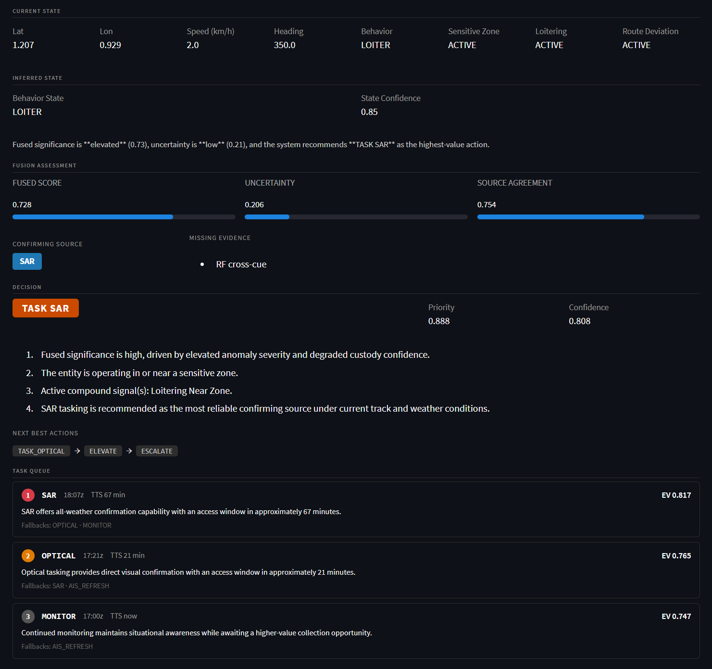
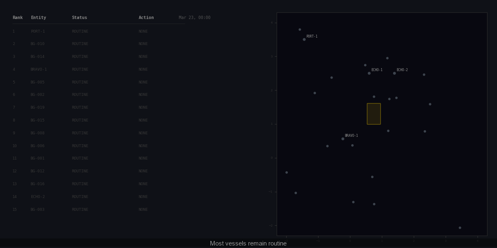

# Custody

**An ISR collection-management reasoning engine with a layered reasoning architecture.**

Custody models the full intelligence loop from raw observation to ranked collection recommendation: multi-source evidence fusion, mission-level decision-making with explainability, and collection orchestration against real orbital pass windows. The system tells an analyst not just *what* to do but *why*, *in what window*, and *what the alternatives are if it fails*.

---

## The problem it solves

In maritime surveillance, custody of a target degrades continuously. AIS can go dark. Behavioral anomalies compound. Sensors are constrained by orbital geometry, cloud cover, and competing priorities across a vessel population. A naive system answers "task this sensor." A good one answers: "the fused evidence picture shows elevated significance and unresolved uncertainty — task SAR in the next 12-minute access window at 14:49z; if that misses, fall back to optical at 16:29z with this expected information gain."

Custody builds toward the second kind of system.

---

## Architecture

Seven layers, each with a clean data contract. Each layer reads from the previous layer's output and writes nothing back.

```
  Raw Observations (AIS, simulation)
           │
           ▼
 ┌─────────────────────────────────┐
 │  Layer 1: Source Ingestion      │  custody/ais.py · custody/simulate.py
 │  Normalise inputs               │
 └─────────────────────────────────┘
           │
           ▼
 ┌─────────────────────────────────┐
 │  Layer 2: Custody State         │  custody/tracks.py · custody/models.py
 │  Evolving entity belief         │  TrackState: uncertainty_km,
 │  Position · uncertainty · time  │  custody_confidence, last_collection_time
 └─────────────────────────────────┘
           │
           ▼
 ┌─────────────────────────────────┐
 │  Layer 3: Behavior & Anomaly    │  custody/behavior/ · custody/compounds.py
 │  Atomic + compound signals      │  BehaviorSignal, CompoundSignal
 │  Loitering · zone proximity     │  scored multi-signal behavioral patterns
 │  Route deviation · AIS gap      │
 └─────────────────────────────────┘
           │
           ▼
 ┌─────────────────────────────────┐
 │  Layer 4: Fusion & Belief       │  custody/fusion.py
 │  Multi-source reconciliation    │  FusionAssessment:
 │                                 │    fused_score   = 0.45·anomaly
 │                                 │                  + 0.35·compound_conf
 │                                 │                  + 0.20·(1−custody)
 │                                 │    uncertainty   = 0.50·(1−custody)
 │                                 │                  + 0.30·(1−agreement)
 │                                 │                  + 0.20·evidence_gap
 │                                 │    missing_evidence[], recommended_source
 └─────────────────────────────────┘
           │
           ▼
 ┌─────────────────────────────────┐
 │  Layer 5: Mission Reasoning     │  custody/decision.py
 │  "So what, and what next?"      │  Decision:
 │                                 │    action ∈ {PASSIVE_MONITOR, ELEVATE,
 │                                 │              TASK_OPTICAL, TASK_SAR,
 │                                 │              ESCALATE}
 │                                 │    priority, confidence
 │                                 │    why[]              ← operator-grade
 │                                 │    next_best_actions[] ← ordered fallbacks
 └─────────────────────────────────┘
           │
           ▼
 ┌─────────────────────────────────┐
 │  Layer 6: Collection            │  custody/taskrecommendation.py
 │  Orchestration                  │  TaskRecommendation:
 │  "Which asset, when, and why?"  │    sensor, window_start, window_end
 │                                 │    expected_value = 0.40·priority
 │                                 │                   + 0.25·confidence
 │                                 │                   + 0.20·sensor_fit
 │                                 │                   + 0.15·timing_score
 │                                 │    reason, fallbacks[], rank
 └─────────────────────────────────┘
           │
           ▼
 ┌─────────────────────────────────┐
 │  Layer 7: Analyst Interface     │  src/app/
 │  Reasoning-forward UI           │  Streamlit dashboard with step-by-step
 │                                 │  playback: fusion → decision → task queue
 └─────────────────────────────────┘
```

---

## The demo story

The simulation runs two vessels through a 9-hour scenario. Here is what the reasoning chain produces as one vessel escalates:

| Step | Behavior | Fused Score | Decision | Top Task |
|------|----------|------------|----------|----------|
| 10:00z | Transit | 0.03 | PASSIVE_MONITOR | MONITOR |
| 14:00z | Approach | 0.34 | PASSIVE_MONITOR | MONITOR (sub-threshold) |
| 15:00z | Approach, significance crossing | 0.50 | ELEVATE | AIS_REFRESH EV=0.66 |
| 16:00z | Loitering near zone | 0.69 | TASK_SAR | SAR EV=0.87, TTS=29 min |
| 17:00z | Loitering, compound active | 0.73 | TASK_SAR | SAR EV=0.82, TTS=67 min |
| 18:00z | Loitering, anomaly peak | 0.76 | TASK_SAR | SAR EV=0.90, TTS=7 min |

The system explains every transition. At 17:00z the Decision panel reads:

> *Fused significance is elevated (0.73), uncertainty is low (0.21),*
> *and the system recommends TASK SAR as the highest-value action.*
>
> **Why:**
> 1. Fused significance is high, driven by elevated anomaly severity and degraded custody confidence.
> 2. The entity is operating in or near a sensitive zone.
> 3. Active compound signal(s): Loitering Near Zone.
> 4. SAR tasking is recommended as the most reliable confirming source under current track and weather conditions.
>
> **Task queue:** SAR EV=0.82 (TTS 67 min) → OPTICAL EV=0.77 (TTS 21 min) → MONITOR EV=0.75
> **Next best actions:** TASK_OPTICAL → ELEVATE → ESCALATE



The animated progression below shows the full 10-hour scenario — fused score, decision action, and task queue updating at each timestep as V001 escalates from passive transit to SAR tasking.



---

## Sensor model

Three abstract sensor types are resolved against real orbital pass windows using SGP4 propagation:

| Abstract label | Satellites | Orbit | Passes on 2026-03-23 |
|---|---|---|---|
| `OPTICAL` | EO-MIO-1, EO-MIO-2 | 51.6° MIO ~400 km | 11:33z, 13:51z |
| `OPTICAL` | EO-SSO-1, EO-SSO-2 | 97.8° SSO ~600 km | 10:00z, 18:00z |
| `SAR` | SAR-1, SAR-2 | 97.8° SSO ~700 km | 12:21z, 13:59z (SAR-1) · 16:29z, 18:08z (SAR-2) |
| `AIS_REFRESH` | — | Immediate | Always (synthetic 30-min window) |
| `MONITOR` | — | Passive | Always (synthetic 2-hr window) |

The task planner searches all satellites of a type and returns the nearest upcoming pass. Sensors with no accessible window within the horizon are omitted from the queue; MONITOR ensures the queue is never empty.

---

## Quickstart

```bash
uv sync
uv run streamlit run src/app/streamlit_app.py
```

Requires Python ≥ 3.12 and [uv](https://docs.astral.sh/uv/).

The dashboard opens in simulation mode with two synthetic vessels. Use the timeline slider to step through the scenario. The reasoning stack (Fusion Assessment → Decision → Task Queue) updates at each step.

---

## Running tests

```bash
uv run pytest tests/
```

**1082 tests** across: orbital mechanics, SGP4 propagation, sensor scheduling, AIS ingestion, track state, behavior detection, anomaly scoring, compound signals, alert layer, collection planner, multi-vessel arbitration, decision trace, what-if analysis, fusion assessment, mission reasoning, task recommendation, and dashboard data pipeline.

---

## Key data contracts

```python
@dataclass(frozen=True)
class FusionAssessment:
    entity_id: str
    timestamp: datetime
    fused_score: float              # [0,1] composite significance
    uncertainty: float              # [0,1] evidence confidence gap
    source_agreement: float         # [0,1] cross-source consistency
    missing_evidence: list[str]     # what would reduce uncertainty
    recommended_confirming_source: Optional[str]   # "OPTICAL" | "SAR" | "AIS" | None

@dataclass(frozen=True)
class Decision:
    entity_id: str
    timestamp: datetime
    action: str                     # PASSIVE_MONITOR | ELEVATE | TASK_OPTICAL | TASK_SAR | ESCALATE
    priority: float                 # [0,1] mission-facing urgency
    confidence: float               # [0,1] confidence in the chosen action
    why: list[str]                  # operator-grade rationale bullets
    next_best_actions: list[str]    # ordered fallback actions

@dataclass(frozen=True)
class TaskRecommendation:
    task_id: str                    # e.g. "task_v001_sar_20260323t1449z"
    entity_id: str
    sensor: str                     # OPTICAL | SAR | AIS_REFRESH | MONITOR
    window_start: datetime
    window_end: datetime
    expected_value: float           # [0,1] estimated information gain
    reason: str                     # one-sentence operator justification
    fallbacks: list[str]            # alternative sensors if this task fails
    rank: int                       # 1 = highest expected value
```

---

## Repository layout

```
src/
  custody/
    ais.py              AIS CSV ingestion and single-vessel replay
    alerts.py           Sparse event-style alert layer
    anomalies.py        Composite anomaly scorer
    behavior/           Atomic behavior detectors and state machine
    compounds.py        Multi-signal compound behavioral patterns
    config.py           All thresholds, zone geometry, sensor constants
    decision.py         Mission reasoning layer → Decision
    decision_trace.py   Structured planner decision breakdown
    features/           Motion, zone, and proximity feature extractors
    fusion.py           Multi-source evidence fusion → FusionAssessment
    models.py           Shared dataclasses (TrackState, Vessel, Zone, …)
    orbit.py            TLE parsing, SGP4 propagation, satellite visibility
    planner.py          Legacy collection planner (HOLD/TASK/PREEMPTED gate)
    sensors.py          Orbital and schedule-based sensor catalog
    simulate.py         Multi-vessel simulation with per-timestep arbitration
    taskrecommendation.py  Collection orchestration → ranked TaskRecommendation queue
    tracks.py           Track position update and uncertainty decay
    whatif.py           Config-variant comparison engine
  app/
    streamlit_app.py        Main dashboard
    entity_detail_panel.py  Fusion → Decision → Task Queue panel
    compound_panels.py      Compound signal history and active views
    orbital_passes_panel.py Raw orbital pass reference table
    whatif_panel.py         What-if results display
tests/                  1082 tests, one file per module
```
