<!--
Ground truth: hand-labeled persistence pairs for Tennent 2023-07-02 ↔ 2023-07-23.

Labels applied by human reviewer on 2026-04-21 as part of V1 SignatureMatcher
evaluation (see ADR-0019, ADR-0020). Labels are canonical for validation of
future matcher implementations against this scene pair.

43 candidate pairs within 50m spatial gate. Each pair has a 'Human label:' line
with one of: same / different / ambiguous.

See scripts/ground_truth_evaluate.py for scoring against this file.
-->
# SignatureMatcher V1 — hand-labeling sheet

Ground-truth harness for the tennent_20230702 <-> tennent_20230723 scene pair, gate 50 m.  Each row is one candidate pair whose tangent-plane spatial distance is within the gate.  The `direct_accept` / `signature_accept` columns are the matcher verdicts for that exact pair under Hungarian assignment; the `human_label` line is left blank for manual completion (`same` / `different` / `ambiguous`).

Counts: **43** candidate pairs; DirectSpatialMatcher accepts **22**, SignatureMatcher(gate_m=50, sig_gate=0.8) accepts **16**.  Rows sorted by spatial distance ascending.

Chips are centered on each bbox centroid (green rectangle = bbox, red crosshair = centroid).  Per-pair chip size is adaptive to the larger of the two bboxes, capped at 384 px.

Provenance: generated by `scripts/ground_truth_prepare.py tennent_20230702 tennent_20230723`.  Companion CSV: `tests/fixtures/ground_truth/tennent_0702_0723.csv`.

---

## pair_01 — spatial 6.61 m, signature 1.073

- **Direct:** ACCEPT   |   **Signature (V1):** reject
- **2023-07-02 obs:** `umbra-2023-07-02-vlm-1688306455-1916-3741`
- **2023-07-23 obs:** `umbra-2023-07-23-vlm-1690120970-1973-3846`
- **2023-07-02 lat/lon:** (8.855075, 114.661158)
- **2023-07-23 lat/lon:** (8.855135, 114.661163)
- **Bbox A (w x h):** 90 x 45 px,  conf=0.6
- **Bbox B (w x h):** 80 x 190 px,  conf=0.85
- **Chip size:** 240 x 240 px

| 2023-07-02 | 2023-07-23 |
|---|---|
| 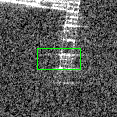 | 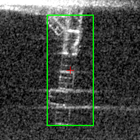 |

**detector_reasoning — 2023-07-02**

> Compact bright return in the center of the image, slightly below vessel 2. Rectangular bright signature on dark water background consistent with a vessel. Could be a separate smaller vessel or part of the grouping near vessel 2.

**detector_reasoning — 2023-07-23**

> Distinct cluster of bright rectangular returns forming a vertical arrangement in the center-right area. Multiple strong point scatterers arranged in a pattern consistent with ship superstructure, masts, or deck equipment. The geometric regularity and high RCS contrast against dark background are hallmarks of a vessel.

**Human label:** `same` (same / different / ambiguous)

**Notes:** 

---

## pair_02 — spatial 6.92 m, signature 0.371

- **Direct:** ACCEPT   |   **Signature (V1):** ACCEPT
- **2023-07-02 obs:** `umbra-2023-07-02-vlm-1688306455-1252-2714`
- **2023-07-23 obs:** `umbra-2023-07-23-vlm-1690120970-1290-2744`
- **2023-07-02 lat/lon:** (8.851423, 114.662137)
- **2023-07-23 lat/lon:** (8.851374, 114.662176)
- **Bbox A (w x h):** 70 x 170 px,  conf=0.85
- **Bbox B (w x h):** 120 x 165 px,  conf=0.85
- **Chip size:** 208 x 208 px

| 2023-07-02 | 2023-07-23 |
|---|---|
| 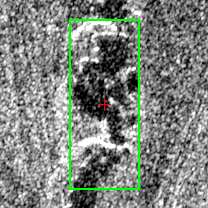 | 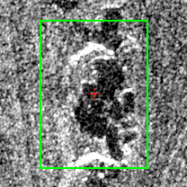 |

**detector_reasoning — 2023-07-02**

> Bright compact elongated return with strong specular reflection consistent with a vessel hull. The shape shows a distinct vessel profile with brighter bow/stern features and a darker shadow region beside it, typical of SAR vessel returns at this resolution. Located on the water surface.

**detector_reasoning — 2023-07-23**

> Large bright compact return with strong specular reflection consistent with a vessel superstructure. The elongated bright region shows typical ship-like geometry with high backscatter from metallic structure. Located in the upper-right portion of the scene on what appears to be water/reef background.

**Human label:** `same` (same / different / ambiguous)

**Notes:** 

---

## pair_03 — spatial 8.52 m, signature 0.456

- **Direct:** ACCEPT   |   **Signature (V1):** ACCEPT
- **2023-07-02 obs:** `umbra-2023-07-02-vlm-1688306455-2349-3132`
- **2023-07-23 obs:** `umbra-2023-07-23-vlm-1690120970-2392-3225`
- **2023-07-02 lat/lon:** (8.854802, 114.663467)
- **2023-07-23 lat/lon:** (8.854775, 114.663394)
- **Bbox A (w x h):** 47 x 40 px,  conf=0.6
- **Bbox B (w x h):** 110 x 65 px,  conf=0.85
- **Chip size:** 144 x 144 px

| 2023-07-02 | 2023-07-23 |
|---|---|
| 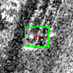 | 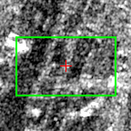 |

**detector_reasoning — 2023-07-02**

> Compact bright return cluster near the top of the image on the reef edge. Shows characteristic bright point-like scatterers consistent with vessel superstructure. Located near the reef boundary where vessels typically anchor.

**detector_reasoning — 2023-07-23**

> Cluster of compact, high-backscatter returns in upper-center region consistent with multiple vessels moored together. The bright rectangular structures with strong specular returns are characteristic of ship superstructures in X-band SAR. Elongated bright features suggest vessel hulls.

**Human label:** `same` (same / different / ambiguous)

**Notes:** 

---

## pair_04 — spatial 11.52 m, signature 0.096

- **Direct:** ACCEPT   |   **Signature (V1):** ACCEPT
- **2023-07-02 obs:** `umbra-2023-07-02-vlm-1688306455-1918-3554`
- **2023-07-23 obs:** `umbra-2023-07-23-vlm-1690120970-1988-3616`
- **2023-07-02 lat/lon:** (8.854692, 114.661595)
- **2023-07-23 lat/lon:** (8.854695, 114.661700)
- **Bbox A (w x h):** 85 x 50 px,  conf=0.6
- **Bbox B (w x h):** 80 x 40 px,  conf=0.6
- **Chip size:** 128 x 128 px

| 2023-07-02 | 2023-07-23 |
|---|---|
|  | 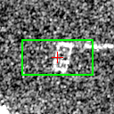 |

**detector_reasoning — 2023-07-02**

> Small compact bright rectangular return on dark water background in the left-center area. The brightness contrast against surrounding water and compact rectangular shape is consistent with a smaller vessel. Weaker return than vessels 1 and 2, suggesting a smaller craft.

**detector_reasoning — 2023-07-23**

> Small compact bright rectangular return isolated against darker background. Size and shape consistent with a smaller vessel or boat. Less prominent than the larger returns but shows sufficient RCS contrast to distinguish from clutter.

**Human label:** `same` (same / different / ambiguous)

**Notes:** 

---

## pair_05 — spatial 12.44 m, signature 0.572

- **Direct:** ACCEPT   |   **Signature (V1):** ACCEPT
- **2023-07-02 obs:** `umbra-2023-07-02-vlm-1688306455-3661-2766`
- **2023-07-23 obs:** `umbra-2023-07-23-vlm-1690120970-3796-2889`
- **2023-07-02 lat/lon:** (8.857047, 114.667047)
- **2023-07-23 lat/lon:** (8.857159, 114.667036)
- **Bbox A (w x h):** 165 x 150 px,  conf=0.85
- **Bbox B (w x h):** 110 x 70 px,  conf=0.6
- **Chip size:** 208 x 208 px

| 2023-07-02 | 2023-07-23 |
|---|---|
|  | 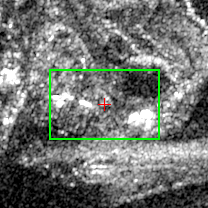 |

**detector_reasoning — 2023-07-02**

> Bright elongated returns on the eastern portion of the reef with star-burst artifacts indicating strong metallic scatterers. Shape and brightness consistent with one or more large vessels moored at the reef structure. The bright flare/sidelobe artifacts extending diagonally are characteristic of large ship superstructures in SAR.

**detector_reasoning — 2023-07-23**

> Bright compact return on darker water background in lower right portion of image. Partially cut off at image edge but shows characteristic vessel-like bright return. Shape and intensity consistent with ship hull though full extent not visible.

**Human label:** `same` (same / different / ambiguous)

**Notes:** 

---

## pair_06 — spatial 12.49 m, signature 0.105

- **Direct:** reject   |   **Signature (V1):** reject
- **2023-07-02 obs:** `umbra-2023-07-02-vlm-1688306455-2349-3132`
- **2023-07-23 obs:** `umbra-2023-07-23-vlm-1690120970-2452-3220`
- **2023-07-02 lat/lon:** (8.854802, 114.663467)
- **2023-07-23 lat/lon:** (8.854896, 114.663529)
- **Bbox A (w x h):** 47 x 40 px,  conf=0.6
- **Bbox B (w x h):** 60 x 55 px,  conf=0.6
- **Chip size:** 128 x 128 px

| 2023-07-02 | 2023-07-23 |
|---|---|
|  | 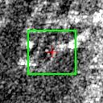 |

**detector_reasoning — 2023-07-02**

> Compact bright return cluster near the top of the image on the reef edge. Shows characteristic bright point-like scatterers consistent with vessel superstructure. Located near the reef boundary where vessels typically anchor.

**detector_reasoning — 2023-07-23**

> Elongated bright return south of the main cluster, oriented roughly N-S, consistent with a moored vessel. Shape and backscatter intensity differ from reef/land returns.

**Human label:** `same` (same / different / ambiguous)

**Notes:** 

---

## pair_07 — spatial 13.47 m, signature 0.324

- **Direct:** ACCEPT   |   **Signature (V1):** ACCEPT
- **2023-07-02 obs:** `umbra-2023-07-02-vlm-1688306455-3531-2474`
- **2023-07-23 obs:** `umbra-2023-07-23-vlm-1690120970-3681-2544`
- **2023-07-02 lat/lon:** (8.856142, 114.667449)
- **2023-07-23 lat/lon:** (8.856198, 114.667558)
- **Bbox A (w x h):** 120 x 90 px,  conf=0.85
- **Bbox B (w x h):** 140 x 60 px,  conf=0.85
- **Chip size:** 176 x 176 px

| 2023-07-02 | 2023-07-23 |
|---|---|
| 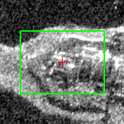 | 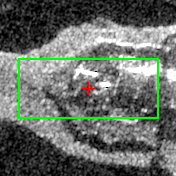 |

**detector_reasoning — 2023-07-02**

> Compact bright elongated return on the reef/water edge in the upper-left portion of the scene. Shows characteristic ship-like shape with strong specular reflection typical of a large vessel hull in SAR imagery. Distinct bright return consistent with a moored ship.

**detector_reasoning — 2023-07-23**

> Compact bright elongated return on darker water background, consistent with vessel hull. Shows characteristic bright scattering typical of metal ship structure. Located at the western end of the reef feature with clear separation from land/reef returns.

**Human label:** `same` (same / different / ambiguous)

**Notes:** 

---

## pair_08 — spatial 13.96 m, signature 0.589

- **Direct:** ACCEPT   |   **Signature (V1):** ACCEPT
- **2023-07-02 obs:** `umbra-2023-07-02-vlm-1688306455-4700-2499`
- **2023-07-23 obs:** `umbra-2023-07-23-vlm-1690120970-4882-2582`
- **2023-07-02 lat/lon:** (8.858872, 114.669834)
- **2023-07-23 lat/lon:** (8.858905, 114.669957)
- **Bbox A (w x h):** 80 x 15 px,  conf=0.6
- **Bbox B (w x h):** 185 x 32 px,  conf=0.85
- **Chip size:** 224 x 224 px

| 2023-07-02 | 2023-07-23 |
|---|---|
| 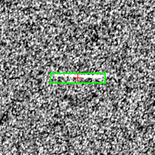 | 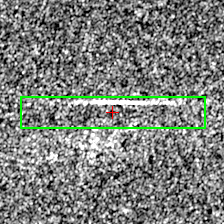 |

**detector_reasoning — 2023-07-02**

> There is a faint but discernible bright linear return at approximately this location in the upper-left quadrant of the image. It appears as a short horizontal bright streak against the darker background, consistent with azimuth smearing of a moving vessel or a stationary vessel's specular return at X-band. The elongated horizontal character is characteristic of SAR smearing artifacts associated with ship targets. The return is brighter than the surrounding sea clutter, though relatively faint, suggesting a small vessel or one at the edge of detectability at this resolution.

**detector_reasoning — 2023-07-23**

> Horizontal bright linear streak with a small bright point-like return near the center. This is a classic SAR azimuth smear artifact caused by a moving vessel — the bright point is the vessel's actual position and the horizontal streak extending in the azimuth direction is due to Doppler-induced displacement of moving target energy. The streak orientation is consistent with along-track azimuth smearing typical of X-band SAR for a vessel underway.

**Human label:** `same` (same / different / ambiguous)

**Notes:** 

---

## pair_09 — spatial 14.36 m, signature 1.025

- **Direct:** ACCEPT   |   **Signature (V1):** reject
- **2023-07-02 obs:** `umbra-2023-07-02-vlm-1688306455-1500-3352`
- **2023-07-23 obs:** `umbra-2023-07-23-vlm-1690120970-1517-3465`
- **2023-07-02 lat/lon:** (8.853316, 114.661184)
- **2023-07-23 lat/lon:** (8.853354, 114.661059)
- **Bbox A (w x h):** 35 x 25 px,  conf=0.6
- **Bbox B (w x h):** 18 x 90 px,  conf=0.85
- **Chip size:** 128 x 128 px

| 2023-07-02 | 2023-07-23 |
|---|---|
|  | 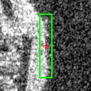 |

**detector_reasoning — 2023-07-02**

> Bright compact return located along the reef edge on the water side. Distinct from reef structure returns, showing point-like scattering consistent with a vessel hull. Positioned just off the reef margin.

**detector_reasoning — 2023-07-23**

> Compact bright return visible at the left edge of the image with high radar cross-section consistent with a metal vessel hull. The elongated bright white object shows the characteristic shape of a ship partially cut off by the image boundary. A horizontal streak/smear extends to the right at approximately y=460, consistent with azimuth smearing artifact from a moving vessel or its wake signature in SAR imagery.

**Human label:** `different` (same / different / ambiguous)

**Notes:** 

---

## pair_10 — spatial 14.90 m, signature 0.246

- **Direct:** ACCEPT   |   **Signature (V1):** ACCEPT
- **2023-07-02 obs:** `umbra-2023-07-02-vlm-1688306455-4988-1993`
- **2023-07-23 obs:** `umbra-2023-07-23-vlm-1690120970-5108-2100`
- **2023-07-02 lat/lon:** (8.858479, 114.671599)
- **2023-07-23 lat/lon:** (8.858411, 114.671482)
- **Bbox A (w x h):** 90 x 40 px,  conf=0.6
- **Bbox B (w x h):** 45 x 20 px,  conf=0.6
- **Chip size:** 128 x 128 px

| 2023-07-02 | 2023-07-23 |
|---|---|
|  |  |

**detector_reasoning — 2023-07-02**

> Intermediate bright return connecting the upper and lower bright clusters, possibly a vessel or the wake/smearing artifact between two closely spaced vessels. The brightness level exceeds background noise suggesting a real scatterer.

**detector_reasoning — 2023-07-23**

> Bright compact return along the diagonal linear feature in the lower portion of the image. The discrete bright spot is slightly elevated above the surrounding feature brightness, suggesting a vessel moored or anchored near the reef structure at approximately (370, 500).

**Human label:** `ambiguous` (same / different / ambiguous)

**Notes:** 

---

## pair_11 — spatial 15.59 m, signature 0.044

- **Direct:** ACCEPT   |   **Signature (V1):** ACCEPT
- **2023-07-02 obs:** `umbra-2023-07-02-vlm-1688306455-3658-2190`
- **2023-07-23 obs:** `umbra-2023-07-23-vlm-1690120970-3824-2253`
- **2023-07-02 lat/lon:** (8.855845, 114.668368)
- **2023-07-23 lat/lon:** (8.855912, 114.668493)
- **Bbox A (w x h):** 65 x 45 px,  conf=0.6
- **Bbox B (w x h):** 70 x 45 px,  conf=0.6
- **Chip size:** 128 x 128 px

| 2023-07-02 | 2023-07-23 |
|---|---|
| 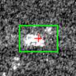 | 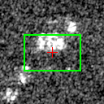 |

**detector_reasoning — 2023-07-02**

> Compact bright cluster below the primary vessel return. Could be a smaller vessel or secondary vessel in the anchorage. Distinct from background noise due to brightness and spatial compactness, but smaller RCS suggests smaller vessel.

**detector_reasoning — 2023-07-23**

> Compact cluster of bright point-like returns on dark water background. Brightness significantly above the surrounding speckle noise level. Could represent a smaller vessel or group of vessels. Less elongated than vessel 1 but intensity is consistent with metal structure.

**Human label:** `same` (same / different / ambiguous)

**Notes:** 

---

## pair_12 — spatial 15.71 m, signature 0.423

- **Direct:** reject   |   **Signature (V1):** reject
- **2023-07-02 obs:** `umbra-2023-07-02-vlm-1688306455-4966-2048`
- **2023-07-23 obs:** `umbra-2023-07-23-vlm-1690120970-5108-2100`
- **2023-07-02 lat/lon:** (8.858541, 114.671426)
- **2023-07-23 lat/lon:** (8.858411, 114.671482)
- **Bbox A (w x h):** 100 x 55 px,  conf=0.85
- **Bbox B (w x h):** 45 x 20 px,  conf=0.6
- **Chip size:** 128 x 128 px

| 2023-07-02 | 2023-07-23 |
|---|---|
|  | 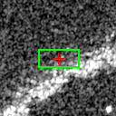 |

**detector_reasoning — 2023-07-02**

> Bright point-like to elongated return in upper-center area of the bright feature cluster. Compact bright SAR return consistent with metal vessel hull. Shows characteristic bright spot response against dark water background.

**detector_reasoning — 2023-07-23**

> Bright compact return along the diagonal linear feature in the lower portion of the image. The discrete bright spot is slightly elevated above the surrounding feature brightness, suggesting a vessel moored or anchored near the reef structure at approximately (370, 500).

**Human label:** `different` (same / different / ambiguous)

**Notes:** 

---

## pair_13 — spatial 17.39 m, signature 0.383

- **Direct:** ACCEPT   |   **Signature (V1):** ACCEPT
- **2023-07-02 obs:** `umbra-2023-07-02-vlm-1688306455-1783-3626`
- **2023-07-23 obs:** `umbra-2023-07-23-vlm-1690120970-1860-3676`
- **2023-07-02 lat/lon:** (8.854533, 114.661146)
- **2023-07-23 lat/lon:** (8.854539, 114.661304)
- **Bbox A (w x h):** 340 x 110 px,  conf=0.85
- **Bbox B (w x h):** 400 x 85 px,  conf=0.85
- **Chip size:** 384 x 384 px

| 2023-07-02 | 2023-07-23 |
|---|---|
|  |  |

**detector_reasoning — 2023-07-02**

> Large, highly bright elongated return in the upper-left portion of the image with strong specular reflection characteristic of a large metal vessel. The intense brightness and elongated structure along with what appears to be azimuth smearing/wake streak extending diagonally is consistent with a large ship (likely a coast guard or navy vessel given the reef context). The horizontal streak trailing from it is classic azimuth smearing of a moving or stationary large metallic target.

**detector_reasoning — 2023-07-23**

> Large elongated bright return spanning much of the upper-left to upper-center of the image. Strong specular reflection with characteristic azimuth smearing (horizontal streaking) extending to the right. The bright linear structure with high RCS is consistent with a large vessel (likely a ship ~100m+ in length). The dark shadow region below is consistent with radar shadow cast by a large structure.

**Human label:** `same` (same / different / ambiguous)

**Notes:** 

---

## pair_14 — spatial 18.16 m, signature 0.429

- **Direct:** ACCEPT   |   **Signature (V1):** ACCEPT
- **2023-07-02 obs:** `umbra-2023-07-02-vlm-1688306455-3571-2634`
- **2023-07-23 obs:** `umbra-2023-07-23-vlm-1690120970-3691-2669`
- **2023-07-02 lat/lon:** (8.856566, 114.667164)
- **2023-07-23 lat/lon:** (8.856477, 114.667303)
- **Bbox A (w x h):** 180 x 120 px,  conf=0.85
- **Bbox B (w x h):** 130 x 60 px,  conf=0.85
- **Chip size:** 224 x 224 px

| 2023-07-02 | 2023-07-23 |
|---|---|
| 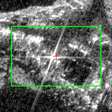 | 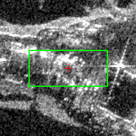 |

**detector_reasoning — 2023-07-02**

> Large bright cluster of returns in the upper-center area of the reef showing strong point scatterers (bright star-burst artifacts) characteristic of large metal structures/ships. The cross-shaped bright artifacts (sidelobes) are typical of very bright radar targets like large vessels. Multiple ships likely moored together at the reef.

**detector_reasoning — 2023-07-23**

> Bright elongated return with strong specular reflection point (bright cross/star artifact visible around pixel 390,245), indicating large metallic vessel. The point target artifact (azimuth streaking) is characteristic of a large ship with highly reflective structures such as superstructure or radar mast.

**Human label:** `same` (same / different / ambiguous)

**Notes:** 

---

## pair_15 — spatial 18.21 m, signature 0.563

- **Direct:** ACCEPT   |   **Signature (V1):** ACCEPT
- **2023-07-02 obs:** `umbra-2023-07-02-vlm-1688306455-2068-3551`
- **2023-07-23 obs:** `umbra-2023-07-23-vlm-1690120970-2160-3606`
- **2023-07-02 lat/lon:** (8.855030, 114.661914)
- **2023-07-23 lat/lon:** (8.855052, 114.662078)
- **Bbox A (w x h):** 80 x 90 px,  conf=0.85
- **Bbox B (w x h):** 100 x 45 px,  conf=0.6
- **Chip size:** 128 x 128 px

| 2023-07-02 | 2023-07-23 |
|---|---|
| 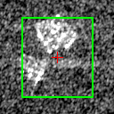 | 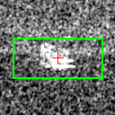 |

**detector_reasoning — 2023-07-02**

> Bright compact return in the lower-left quadrant with a very bright specular point (likely vessel superstructure/mast) and associated rectangular body return below it. The combination of a strong point scatterer with a rectangular body return is a classic SAR vessel signature. The brightness and structure strongly indicate a medium-sized vessel.

**detector_reasoning — 2023-07-23**

> Compact bright return in the lower-left quadrant with slight horizontal smearing suggesting a moving or stationary vessel. The elongated bright signature with azimuth streaking is consistent with a vessel on water.

**Human label:** `same` (same / different / ambiguous)

**Notes:** 

---

## pair_16 — spatial 18.51 m, signature 0.869

- **Direct:** reject   |   **Signature (V1):** reject
- **2023-07-02 obs:** `umbra-2023-07-02-vlm-1688306455-1462-3340`
- **2023-07-23 obs:** `umbra-2023-07-23-vlm-1690120970-1517-3465`
- **2023-07-02 lat/lon:** (8.853204, 114.661134)
- **2023-07-23 lat/lon:** (8.853354, 114.661059)
- **Bbox A (w x h):** 30 x 30 px,  conf=0.6
- **Bbox B (w x h):** 18 x 90 px,  conf=0.85
- **Chip size:** 128 x 128 px

| 2023-07-02 | 2023-07-23 |
|---|---|
|  |  |

**detector_reasoning — 2023-07-02**

> Compact bright return near the water-reef interface at approximately (460, 310). Isolated bright point with higher backscatter than surrounding water, consistent with a small vessel or boat. Size and intensity suggest a smaller craft.

**detector_reasoning — 2023-07-23**

> Compact bright return visible at the left edge of the image with high radar cross-section consistent with a metal vessel hull. The elongated bright white object shows the characteristic shape of a ship partially cut off by the image boundary. A horizontal streak/smear extends to the right at approximately y=460, consistent with azimuth smearing artifact from a moving vessel or its wake signature in SAR imagery.

**Human label:** `different` (same / different / ambiguous)

**Notes:** 

---

## pair_17 — spatial 20.67 m, signature 0.157

- **Direct:** reject   |   **Signature (V1):** ACCEPT
- **2023-07-02 obs:** `umbra-2023-07-02-vlm-1688306455-1873-3771`
- **2023-07-23 obs:** `umbra-2023-07-23-vlm-1690120970-1973-3846`
- **2023-07-02 lat/lon:** (8.855040, 114.661001)
- **2023-07-23 lat/lon:** (8.855135, 114.661163)
- **Bbox A (w x h):** 90 x 170 px,  conf=0.85
- **Bbox B (w x h):** 80 x 190 px,  conf=0.85
- **Chip size:** 240 x 240 px

| 2023-07-02 | 2023-07-23 |
|---|---|
| 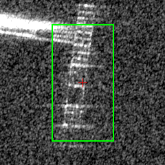 |  |

**detector_reasoning — 2023-07-02**

> Bright, structured rectangular return in the upper-center area of the image. The blocky, gridded bright pattern is characteristic of a vessel's superstructure producing strong corner reflector returns in SAR imagery. The elongated vertical arrangement suggests a medium-to-large vessel oriented roughly north-south.

**detector_reasoning — 2023-07-23**

> Distinct cluster of bright rectangular returns forming a vertical arrangement in the center-right area. Multiple strong point scatterers arranged in a pattern consistent with ship superstructure, masts, or deck equipment. The geometric regularity and high RCS contrast against dark background are hallmarks of a vessel.

**Human label:** `same` (same / different / ambiguous)

**Notes:** 

---

## pair_18 — spatial 21.69 m, signature 0.261

- **Direct:** ACCEPT   |   **Signature (V1):** ACCEPT
- **2023-07-02 obs:** `umbra-2023-07-02-vlm-1688306455-1582-3380`
- **2023-07-23 obs:** `umbra-2023-07-23-vlm-1690120970-1614-3521`
- **2023-07-02 lat/lon:** (8.853562, 114.661293)
- **2023-07-23 lat/lon:** (8.853682, 114.661137)
- **Bbox A (w x h):** 140 x 30 px,  conf=0.85
- **Bbox B (w x h):** 130 x 25 px,  conf=0.6
- **Chip size:** 176 x 176 px

| 2023-07-02 | 2023-07-23 |
|---|---|
| 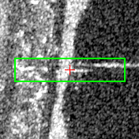 | 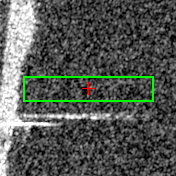 |

**detector_reasoning — 2023-07-02**

> Bright elongated return with strong specular reflection characteristic of a metal vessel hull. The horizontal streak extending to the right (~430-570 pixels) is consistent with azimuth smearing of a moving or stationary vessel. Located on the water side of the reef boundary. The bright point target with trailing smear is a classic SAR vessel signature.

**detector_reasoning — 2023-07-23**

> Horizontal bright linear streak extending from the left edge toward the center of the image at approximately y=462. This is consistent with azimuth smearing of a moving vessel in SAR imagery, where vessel motion during the synthetic aperture collection time causes energy to be distributed along the azimuth direction. The streak appears to originate from the bright vessel return at the left edge, suggesting it is a motion artifact associated with vessel ID 1, but could also indicate a separate moving vessel whose main return is smeared beyond recognition.

**Human label:** `different` (same / different / ambiguous)

**Notes:** 

---

## pair_19 — spatial 25.36 m, signature 0.239

- **Direct:** ACCEPT   |   **Signature (V1):** ACCEPT
- **2023-07-02 obs:** `umbra-2023-07-02-vlm-1688306455-3538-2240`
- **2023-07-23 obs:** `umbra-2023-07-23-vlm-1690120970-3696-2253`
- **2023-07-02 lat/lon:** (8.855674, 114.668002)
- **2023-07-23 lat/lon:** (8.855633, 114.668229)
- **Bbox A (w x h):** 255 x 65 px,  conf=0.85
- **Bbox B (w x h):** 210 x 50 px,  conf=0.85
- **Chip size:** 320 x 320 px

| 2023-07-02 | 2023-07-23 |
|---|---|
| 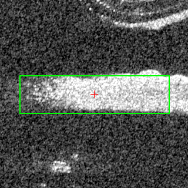 | 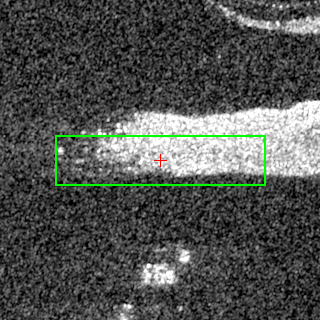 |

**detector_reasoning — 2023-07-02**

> Large elongated bright return with horizontal smearing consistent with a substantial vessel (likely a large ship or coast guard vessel). The azimuth smearing streak and strong radar cross-section are classic SAR vessel signatures. Length suggests ~80-100m vessel.

**detector_reasoning — 2023-07-23**

> Prominent elongated bright return characteristic of a large vessel hull. The horizontal streak/smear extending leftward is consistent with azimuth smearing of a moving or stationary vessel in SAR imagery. Strong specular reflection indicates a metal hull. The elongated shape (~210 pixels long) suggests a sizeable ship.

**Human label:** `same` (same / different / ambiguous)

**Notes:** 

---

## pair_20 — spatial 25.99 m, signature 0.433

- **Direct:** reject   |   **Signature (V1):** reject
- **2023-07-02 obs:** `umbra-2023-07-02-vlm-1688306455-3571-2634`
- **2023-07-23 obs:** `umbra-2023-07-23-vlm-1690120970-3718-2792`
- **2023-07-02 lat/lon:** (8.856566, 114.667164)
- **2023-07-23 lat/lon:** (8.856789, 114.667090)
- **Bbox A (w x h):** 180 x 120 px,  conf=0.85
- **Bbox B (w x h):** 115 x 65 px,  conf=0.85
- **Chip size:** 224 x 224 px

| 2023-07-02 | 2023-07-23 |
|---|---|
|  | 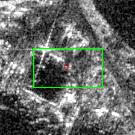 |

**detector_reasoning — 2023-07-02**

> Large bright cluster of returns in the upper-center area of the reef showing strong point scatterers (bright star-burst artifacts) characteristic of large metal structures/ships. The cross-shaped bright artifacts (sidelobes) are typical of very bright radar targets like large vessels. Multiple ships likely moored together at the reef.

**detector_reasoning — 2023-07-23**

> Distinct bright elongated return consistent with vessel hull signature, positioned on water adjacent to reef. Shows strong backscatter typical of metal ship construction. Orientation consistent with other vessels in the anchorage.

**Human label:** `different` (same / different / ambiguous)

**Notes:** 

---

## pair_21 — spatial 27.06 m, signature 1.397

- **Direct:** ACCEPT   |   **Signature (V1):** reject
- **2023-07-02 obs:** `umbra-2023-07-02-vlm-1688306455-981-2579`
- **2023-07-23 obs:** `umbra-2023-07-23-vlm-1690120970-946-2579`
- **2023-07-02 lat/lon:** (8.850522, 114.661882)
- **2023-07-23 lat/lon:** (8.850283, 114.661829)
- **Bbox A (w x h):** 210 x 310 px,  conf=0.85
- **Bbox B (w x h):** 40 x 100 px,  conf=0.6
- **Chip size:** 384 x 384 px

| 2023-07-02 | 2023-07-23 |
|---|---|
| 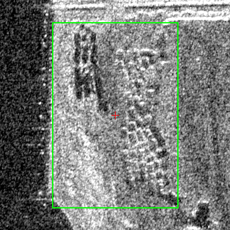 | 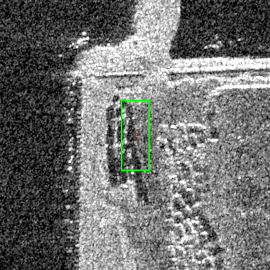 |

**detector_reasoning — 2023-07-02**

> Large bright elongated structure visible in the lower-center portion of the image. Shows strong radar returns consistent with a large vessel (likely a coast guard or military ship). The structure has a distinct hull shape with bright metallic returns, visible superstructure elements, and is positioned at what appears to be a reef/shoal area. The elongated bright return with internal structure complexity is characteristic of a large ship in SAR imagery.

**detector_reasoning — 2023-07-23**

> Compact bright return cluster on the western edge of the reef structure. The elongated bright signature with discrete scattering centers is consistent with a vessel (likely a ship moored at the reef). The double-row of bright scatterers is characteristic of a ship's superstructure in SAR imagery.

**Human label:** `same` (same / different / ambiguous)

**Notes:** 

---

## pair_22 — spatial 27.97 m, signature 0.923

- **Direct:** reject   |   **Signature (V1):** reject
- **2023-07-02 obs:** `umbra-2023-07-02-vlm-1688306455-3658-2190`
- **2023-07-23 obs:** `umbra-2023-07-23-vlm-1690120970-3696-2253`
- **2023-07-02 lat/lon:** (8.855845, 114.668368)
- **2023-07-23 lat/lon:** (8.855633, 114.668229)
- **Bbox A (w x h):** 65 x 45 px,  conf=0.6
- **Bbox B (w x h):** 210 x 50 px,  conf=0.85
- **Chip size:** 256 x 256 px

| 2023-07-02 | 2023-07-23 |
|---|---|
| 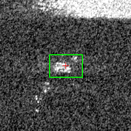 | 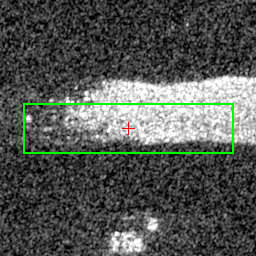 |

**detector_reasoning — 2023-07-02**

> Compact bright cluster below the primary vessel return. Could be a smaller vessel or secondary vessel in the anchorage. Distinct from background noise due to brightness and spatial compactness, but smaller RCS suggests smaller vessel.

**detector_reasoning — 2023-07-23**

> Prominent elongated bright return characteristic of a large vessel hull. The horizontal streak/smear extending leftward is consistent with azimuth smearing of a moving or stationary vessel in SAR imagery. Strong specular reflection indicates a metal hull. The elongated shape (~210 pixels long) suggests a sizeable ship.

**Human label:** `_____` (same / different / ambiguous)

**Notes:** 

---

## pair_23 — spatial 28.95 m, signature 0.543

- **Direct:** reject   |   **Signature (V1):** reject
- **2023-07-02 obs:** `umbra-2023-07-02-vlm-1688306455-3661-2766`
- **2023-07-23 obs:** `umbra-2023-07-23-vlm-1690120970-3718-2792`
- **2023-07-02 lat/lon:** (8.857047, 114.667047)
- **2023-07-23 lat/lon:** (8.856789, 114.667090)
- **Bbox A (w x h):** 165 x 150 px,  conf=0.85
- **Bbox B (w x h):** 115 x 65 px,  conf=0.85
- **Chip size:** 208 x 208 px

| 2023-07-02 | 2023-07-23 |
|---|---|
| 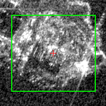 | 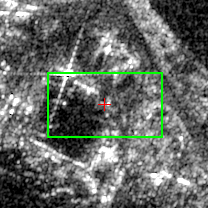 |

**detector_reasoning — 2023-07-02**

> Bright elongated returns on the eastern portion of the reef with star-burst artifacts indicating strong metallic scatterers. Shape and brightness consistent with one or more large vessels moored at the reef structure. The bright flare/sidelobe artifacts extending diagonally are characteristic of large ship superstructures in SAR.

**detector_reasoning — 2023-07-23**

> Distinct bright elongated return consistent with vessel hull signature, positioned on water adjacent to reef. Shows strong backscatter typical of metal ship construction. Orientation consistent with other vessels in the anchorage.

**Human label:** `different` (same / different / ambiguous)

**Notes:** 

---

## pair_24 — spatial 29.03 m, signature 0.361

- **Direct:** reject   |   **Signature (V1):** reject
- **2023-07-02 obs:** `umbra-2023-07-02-vlm-1688306455-2349-3132`
- **2023-07-23 obs:** `umbra-2023-07-23-vlm-1690120970-2402-3300`
- **2023-07-02 lat/lon:** (8.854802, 114.663467)
- **2023-07-23 lat/lon:** (8.854951, 114.663250)
- **Bbox A (w x h):** 47 x 40 px,  conf=0.6
- **Bbox B (w x h):** 80 x 35 px,  conf=0.6
- **Chip size:** 128 x 128 px

| 2023-07-02 | 2023-07-23 |
|---|---|
| 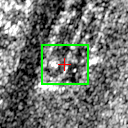 | 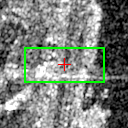 |

**detector_reasoning — 2023-07-02**

> Compact bright return cluster near the top of the image on the reef edge. Shows characteristic bright point-like scatterers consistent with vessel superstructure. Located near the reef boundary where vessels typically anchor.

**detector_reasoning — 2023-07-23**

> Bright linear return extending horizontally in upper-right area, possibly an azimuth smear from a moving vessel or a moored vessel with strong metallic return. The near-horizontal streak is consistent with SAR smearing of a slow-moving target.

**Human label:** `different` (same / different / ambiguous)

**Notes:** 

---

## pair_25 — spatial 30.92 m, signature 0.593

- **Direct:** reject   |   **Signature (V1):** reject
- **2023-07-02 obs:** `umbra-2023-07-02-vlm-1688306455-3571-2634`
- **2023-07-23 obs:** `umbra-2023-07-23-vlm-1690120970-3741-2652`
- **2023-07-02 lat/lon:** (8.856566, 114.667164)
- **2023-07-23 lat/lon:** (8.856551, 114.667445)
- **Bbox A (w x h):** 180 x 120 px,  conf=0.85
- **Bbox B (w x h):** 105 x 50 px,  conf=0.6
- **Chip size:** 224 x 224 px

| 2023-07-02 | 2023-07-23 |
|---|---|
|  | 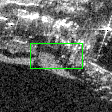 |

**detector_reasoning — 2023-07-02**

> Large bright cluster of returns in the upper-center area of the reef showing strong point scatterers (bright star-burst artifacts) characteristic of large metal structures/ships. The cross-shaped bright artifacts (sidelobes) are typical of very bright radar targets like large vessels. Multiple ships likely moored together at the reef.

**detector_reasoning — 2023-07-23**

> Secondary bright return below the main cluster, showing elongated bright signature consistent with a smaller vessel or barge moored near the reef. Less distinct than primary vessels but shows characteristic ship-like scattering pattern.

**Human label:** `different` (same / different / ambiguous)

**Notes:** 

---

## pair_26 — spatial 31.43 m, signature 0.956

- **Direct:** ACCEPT   |   **Signature (V1):** reject
- **2023-07-02 obs:** `umbra-2023-07-02-vlm-1688306455-1332-2569`
- **2023-07-23 obs:** `umbra-2023-07-23-vlm-1690120970-1472-2616`
- **2023-07-02 lat/lon:** (8.851305, 114.662638)
- **2023-07-23 lat/lon:** (8.851512, 114.662834)
- **Bbox A (w x h):** 40 x 40 px,  conf=0.6
- **Bbox B (w x h):** 115 x 200 px,  conf=0.85
- **Chip size:** 240 x 240 px

| 2023-07-02 | 2023-07-23 |
|---|---|
| 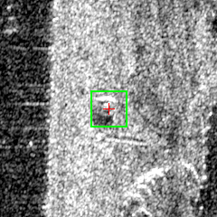 | 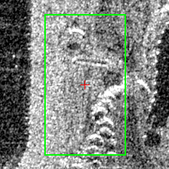 |

**detector_reasoning — 2023-07-02**

> Small compact bright point return with possible azimuth smearing streak, consistent with a smaller vessel or boat. Located in the water area with characteristic bright return against darker background.

**detector_reasoning — 2023-07-23**

> Elongated bright linear return running roughly north-south with segmented bright spots consistent with a ship hull and superstructure elements. The beaded/segmented pattern of bright returns along a linear axis is a classic SAR signature of a vessel's deck structures. Shows azimuth smearing characteristic of a large stationary or slow-moving vessel.

**Human label:** `same` (same / different / ambiguous)

**Notes:** 

---

## pair_27 — spatial 32.31 m, signature 1.788

- **Direct:** ACCEPT   |   **Signature (V1):** reject
- **2023-07-02 obs:** `umbra-2023-07-02-vlm-1688306455-1983-3165`
- **2023-07-23 obs:** `umbra-2023-07-23-vlm-1690120970-1983-3322`
- **2023-07-02 lat/lon:** (8.854033, 114.662625)
- **2023-07-23 lat/lon:** (8.854081, 114.662336)
- **Bbox A (w x h):** 90 x 110 px,  conf=0.85
- **Bbox B (w x h):** 175 x 450 px,  conf=0.85
- **Chip size:** 384 x 384 px

| 2023-07-02 | 2023-07-23 |
|---|---|
| 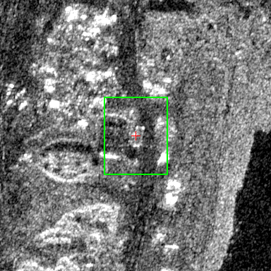 | 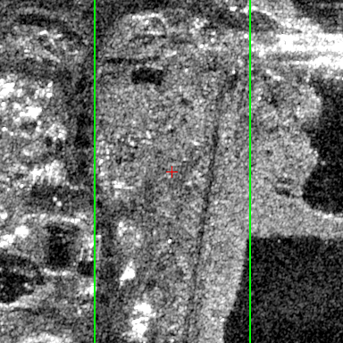 |

**detector_reasoning — 2023-07-02**

> Bright compact elongated return with strong specular highlights consistent with vessel superstructure. Oriented along the reef edge, showing characteristic SAR vessel signature with bright bow/stern returns.

**detector_reasoning — 2023-07-23**

> Second large elongated bright structure to the right and roughly parallel to vessel 1, also oriented NNW-SSE. Shows similar hull-like returns with bright scattering centers distributed along its length. The parallel orientation to vessel 1 is consistent with two vessels moored side-by-side or in close proximity, typical of the Whitsun Reef militia vessel clusters documented in this area. Strong returns along deck structures are visible.

**Human label:** `different` (same / different / ambiguous)

**Notes:** 

---

## pair_28 — spatial 34.07 m, signature 0.503

- **Direct:** reject   |   **Signature (V1):** reject
- **2023-07-02 obs:** `umbra-2023-07-02-vlm-1688306455-5026-1946`
- **2023-07-23 obs:** `umbra-2023-07-23-vlm-1690120970-5108-2100`
- **2023-07-02 lat/lon:** (8.858466, 114.671787)
- **2023-07-23 lat/lon:** (8.858411, 114.671482)
- **Bbox A (w x h):** 125 x 55 px,  conf=0.85
- **Bbox B (w x h):** 45 x 20 px,  conf=0.6
- **Chip size:** 160 x 160 px

| 2023-07-02 | 2023-07-23 |
|---|---|
| 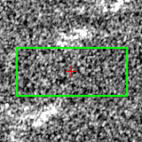 | 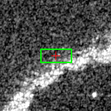 |

**detector_reasoning — 2023-07-02**

> Bright elongated return with characteristic vessel shape on dark water background. Shows strong specular reflection typical of metal hull. Located at lower-left portion of the bright returns cluster, appears as a compact bright scatterer with some azimuth smearing extending horizontally.

**detector_reasoning — 2023-07-23**

> Bright compact return along the diagonal linear feature in the lower portion of the image. The discrete bright spot is slightly elevated above the surrounding feature brightness, suggesting a vessel moored or anchored near the reef structure at approximately (370, 500).

**Human label:** `different` (same / different / ambiguous)

**Notes:** 

---

## pair_29 — spatial 34.52 m, signature 1.660

- **Direct:** reject   |   **Signature (V1):** reject
- **2023-07-02 obs:** `umbra-2023-07-02-vlm-1688306455-1582-3380`
- **2023-07-23 obs:** `umbra-2023-07-23-vlm-1690120970-1517-3465`
- **2023-07-02 lat/lon:** (8.853562, 114.661293)
- **2023-07-23 lat/lon:** (8.853354, 114.661059)
- **Bbox A (w x h):** 140 x 30 px,  conf=0.85
- **Bbox B (w x h):** 18 x 90 px,  conf=0.85
- **Chip size:** 176 x 176 px

| 2023-07-02 | 2023-07-23 |
|---|---|
|  | 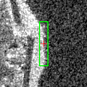 |

**detector_reasoning — 2023-07-02**

> Bright elongated return with strong specular reflection characteristic of a metal vessel hull. The horizontal streak extending to the right (~430-570 pixels) is consistent with azimuth smearing of a moving or stationary vessel. Located on the water side of the reef boundary. The bright point target with trailing smear is a classic SAR vessel signature.

**detector_reasoning — 2023-07-23**

> Compact bright return visible at the left edge of the image with high radar cross-section consistent with a metal vessel hull. The elongated bright white object shows the characteristic shape of a ship partially cut off by the image boundary. A horizontal streak/smear extends to the right at approximately y=460, consistent with azimuth smearing artifact from a moving vessel or its wake signature in SAR imagery.

**Human label:** `different` (same / different / ambiguous)

**Notes:** 

---

## pair_30 — spatial 34.72 m, signature 1.933

- **Direct:** reject   |   **Signature (V1):** reject
- **2023-07-02 obs:** `umbra-2023-07-02-vlm-1688306455-1983-3165`
- **2023-07-23 obs:** `umbra-2023-07-23-vlm-1690120970-2028-3138`
- **2023-07-02 lat/lon:** (8.854033, 114.662625)
- **2023-07-23 lat/lon:** (8.853799, 114.662836)
- **Bbox A (w x h):** 90 x 110 px,  conf=0.85
- **Bbox B (w x h):** 165 x 480 px,  conf=0.85
- **Chip size:** 384 x 384 px

| 2023-07-02 | 2023-07-23 |
|---|---|
|  |  |

**detector_reasoning — 2023-07-02**

> Bright compact elongated return with strong specular highlights consistent with vessel superstructure. Oriented along the reef edge, showing characteristic SAR vessel signature with bright bow/stern returns.

**detector_reasoning — 2023-07-23**

> Large elongated bright return structure running roughly NNW-SSE through the center-left of the image. Shows characteristic hull shape with strong metallic returns along its length, consistent with a large vessel (likely a maritime militia or fishing vessel ~60-80m+ in length given scale). Multiple bright scattering centers visible along the superstructure. The elongated shape, internal structural bright returns, and dark radar shadow on one side are all consistent with a moored ship hull.

**Human label:** `different` (same / different / ambiguous)

**Notes:** 

---

## pair_31 — spatial 35.64 m, signature 0.252

- **Direct:** ACCEPT   |   **Signature (V1):** ACCEPT
- **2023-07-02 obs:** `umbra-2023-07-02-vlm-1688306455-4978-2136`
- **2023-07-23 obs:** `umbra-2023-07-23-vlm-1690120970-5033-2213`
- **2023-07-02 lat/lon:** (8.858752, 114.671251)
- **2023-07-23 lat/lon:** (8.858478, 114.671080)
- **Bbox A (w x h):** 45 x 30 px,  conf=0.6
- **Bbox B (w x h):** 50 x 20 px,  conf=0.6
- **Chip size:** 128 x 128 px

| 2023-07-02 | 2023-07-23 |
|---|---|
|  |  |

**detector_reasoning — 2023-07-02**

> Isolated compact bright return separated from the main cluster to the right. Small but distinct bright point consistent with a smaller vessel or fishing boat. Separation from other returns suggests it is a distinct target rather than sidelobe artifact.

**detector_reasoning — 2023-07-23**

> Compact bright return point target located along the bright linear feature (likely reef/shoal). The bright spot shows characteristics consistent with a vessel's strong radar cross-section return at approximately (485, 425). Located at the brighter concentration along the diagonal feature.

**Human label:** `ambiguous` (same / different / ambiguous)

**Notes:** 

---

## pair_32 — spatial 36.16 m, signature 1.677

- **Direct:** reject   |   **Signature (V1):** reject
- **2023-07-02 obs:** `umbra-2023-07-02-vlm-1688306455-1918-3554`
- **2023-07-23 obs:** `umbra-2023-07-23-vlm-1690120970-1860-3676`
- **2023-07-02 lat/lon:** (8.854692, 114.661595)
- **2023-07-23 lat/lon:** (8.854539, 114.661304)
- **Bbox A (w x h):** 85 x 50 px,  conf=0.6
- **Bbox B (w x h):** 400 x 85 px,  conf=0.85
- **Chip size:** 384 x 384 px

| 2023-07-02 | 2023-07-23 |
|---|---|
| 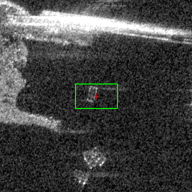 | 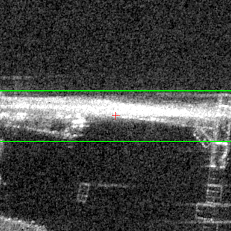 |

**detector_reasoning — 2023-07-02**

> Small compact bright rectangular return on dark water background in the left-center area. The brightness contrast against surrounding water and compact rectangular shape is consistent with a smaller vessel. Weaker return than vessels 1 and 2, suggesting a smaller craft.

**detector_reasoning — 2023-07-23**

> Large elongated bright return spanning much of the upper-left to upper-center of the image. Strong specular reflection with characteristic azimuth smearing (horizontal streaking) extending to the right. The bright linear structure with high RCS is consistent with a large vessel (likely a ship ~100m+ in length). The dark shadow region below is consistent with radar shadow cast by a large structure.

**Human label:** `different` (same / different / ambiguous)

**Notes:** 

---

## pair_33 — spatial 36.66 m, signature 0.322

- **Direct:** ACCEPT   |   **Signature (V1):** ACCEPT
- **2023-07-02 obs:** `umbra-2023-07-02-vlm-1688306455-3285-2293`
- **2023-07-23 obs:** `umbra-2023-07-23-vlm-1690120970-3496-2328`
- **2023-07-02 lat/lon:** (8.855203, 114.667352)
- **2023-07-23 lat/lon:** (8.855350, 114.667651)
- **Bbox A (w x h):** 120 x 130 px,  conf=0.6
- **Bbox B (w x h):** 80 x 80 px,  conf=0.6
- **Chip size:** 160 x 160 px

| 2023-07-02 | 2023-07-23 |
|---|---|
| 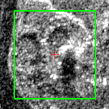 | 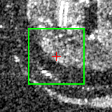 |

**detector_reasoning — 2023-07-02**

> Bright, compact return with complex structure visible at the lower right portion of the image. Shows characteristics consistent with a vessel hull including specular returns and possible superstructure. The circular/oval bright return pattern is consistent with a vessel rather than pure reef structure. Located adjacent to what appears to be the reef edge, consistent with anchored/moored vessel behavior at Whitsun Reef.

**detector_reasoning — 2023-07-23**

> Bright arc/curved return in upper right corner of the image. The curvature and brightness suggest a large vessel partially visible at the image edge. The return pattern is consistent with a ship hull producing strong corner reflections typical in X-band SAR.

**Human label:** `different` (same / different / ambiguous)

**Notes:** 

---

## pair_34 — spatial 37.70 m, signature 0.554

- **Direct:** reject   |   **Signature (V1):** reject
- **2023-07-02 obs:** `umbra-2023-07-02-vlm-1688306455-1146-2734`
- **2023-07-23 obs:** `umbra-2023-07-23-vlm-1690120970-1290-2744`
- **2023-07-02 lat/lon:** (8.851222, 114.661869)
- **2023-07-23 lat/lon:** (8.851374, 114.662176)
- **Bbox A (w x h):** 80 x 80 px,  conf=0.6
- **Bbox B (w x h):** 120 x 165 px,  conf=0.85
- **Chip size:** 208 x 208 px

| 2023-07-02 | 2023-07-23 |
|---|---|
| 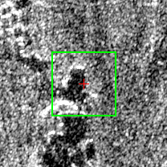 |  |

**detector_reasoning — 2023-07-02**

> Compact bright return visible in the lower-right area of the image, separate from the main vessel. Could represent a smaller vessel (patrol boat or tender) positioned near the larger ship. The localized bright return on darker background is consistent with a small vessel signature in X-band SAR.

**detector_reasoning — 2023-07-23**

> Large bright compact return with strong specular reflection consistent with a vessel superstructure. The elongated bright region shows typical ship-like geometry with high backscatter from metallic structure. Located in the upper-right portion of the scene on what appears to be water/reef background.

**Human label:** `different` (same / different / ambiguous)

**Notes:** 

---

## pair_35 — spatial 38.71 m, signature 0.423

- **Direct:** reject   |   **Signature (V1):** reject
- **2023-07-02 obs:** `umbra-2023-07-02-vlm-1688306455-4966-2048`
- **2023-07-23 obs:** `umbra-2023-07-23-vlm-1690120970-5033-2213`
- **2023-07-02 lat/lon:** (8.858541, 114.671426)
- **2023-07-23 lat/lon:** (8.858478, 114.671080)
- **Bbox A (w x h):** 100 x 55 px,  conf=0.85
- **Bbox B (w x h):** 50 x 20 px,  conf=0.6
- **Chip size:** 128 x 128 px

| 2023-07-02 | 2023-07-23 |
|---|---|
|  | 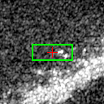 |

**detector_reasoning — 2023-07-02**

> Bright point-like to elongated return in upper-center area of the bright feature cluster. Compact bright SAR return consistent with metal vessel hull. Shows characteristic bright spot response against dark water background.

**detector_reasoning — 2023-07-23**

> Compact bright return point target located along the bright linear feature (likely reef/shoal). The bright spot shows characteristics consistent with a vessel's strong radar cross-section return at approximately (485, 425). Located at the brighter concentration along the diagonal feature.

**Human label:** `different` (same / different / ambiguous)

**Notes:** 

---

## pair_36 — spatial 40.40 m, signature 0.282

- **Direct:** reject   |   **Signature (V1):** reject
- **2023-07-02 obs:** `umbra-2023-07-02-vlm-1688306455-3531-2474`
- **2023-07-23 obs:** `umbra-2023-07-23-vlm-1690120970-3691-2669`
- **2023-07-02 lat/lon:** (8.856142, 114.667449)
- **2023-07-23 lat/lon:** (8.856477, 114.667303)
- **Bbox A (w x h):** 120 x 90 px,  conf=0.85
- **Bbox B (w x h):** 130 x 60 px,  conf=0.85
- **Chip size:** 160 x 160 px

| 2023-07-02 | 2023-07-23 |
|---|---|
| 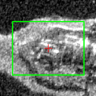 |  |

**detector_reasoning — 2023-07-02**

> Compact bright elongated return on the reef/water edge in the upper-left portion of the scene. Shows characteristic ship-like shape with strong specular reflection typical of a large vessel hull in SAR imagery. Distinct bright return consistent with a moored ship.

**detector_reasoning — 2023-07-23**

> Bright elongated return with strong specular reflection point (bright cross/star artifact visible around pixel 390,245), indicating large metallic vessel. The point target artifact (azimuth streaking) is characteristic of a large ship with highly reflective structures such as superstructure or radar mast.

**Human label:** `different` (same / different / ambiguous)

**Notes:** 

---

## pair_37 — spatial 40.85 m, signature 0.790

- **Direct:** reject   |   **Signature (V1):** reject
- **2023-07-02 obs:** `umbra-2023-07-02-vlm-1688306455-1500-3352`
- **2023-07-23 obs:** `umbra-2023-07-23-vlm-1690120970-1614-3521`
- **2023-07-02 lat/lon:** (8.853316, 114.661184)
- **2023-07-23 lat/lon:** (8.853682, 114.661137)
- **Bbox A (w x h):** 35 x 25 px,  conf=0.6
- **Bbox B (w x h):** 130 x 25 px,  conf=0.6
- **Chip size:** 160 x 160 px

| 2023-07-02 | 2023-07-23 |
|---|---|
|  |  |

**detector_reasoning — 2023-07-02**

> Bright compact return located along the reef edge on the water side. Distinct from reef structure returns, showing point-like scattering consistent with a vessel hull. Positioned just off the reef margin.

**detector_reasoning — 2023-07-23**

> Horizontal bright linear streak extending from the left edge toward the center of the image at approximately y=462. This is consistent with azimuth smearing of a moving vessel in SAR imagery, where vessel motion during the synthetic aperture collection time causes energy to be distributed along the azimuth direction. The streak appears to originate from the bright vessel return at the left edge, suggesting it is a motion artifact associated with vessel ID 1, but could also indicate a separate moving vessel whose main return is smeared beyond recognition.

**Human label:** `different` (same / different / ambiguous)

**Notes:** 

---

## pair_38 — spatial 41.16 m, signature 0.233

- **Direct:** reject   |   **Signature (V1):** reject
- **2023-07-02 obs:** `umbra-2023-07-02-vlm-1688306455-3661-2766`
- **2023-07-23 obs:** `umbra-2023-07-23-vlm-1690120970-3708-2968`
- **2023-07-02 lat/lon:** (8.857047, 114.667047)
- **2023-07-23 lat/lon:** (8.857129, 114.666682)
- **Bbox A (w x h):** 165 x 150 px,  conf=0.85
- **Bbox B (w x h):** 135 x 115 px,  conf=0.85
- **Chip size:** 208 x 208 px

| 2023-07-02 | 2023-07-23 |
|---|---|
|  |  |

**detector_reasoning — 2023-07-02**

> Bright elongated returns on the eastern portion of the reef with star-burst artifacts indicating strong metallic scatterers. Shape and brightness consistent with one or more large vessels moored at the reef structure. The bright flare/sidelobe artifacts extending diagonally are characteristic of large ship superstructures in SAR.

**detector_reasoning — 2023-07-23**

> Compact bright radar return with characteristic vessel hull shape visible in upper portion. Strong specular reflection consistent with metal vessel superstructure. Accompanied by a distinct azimuth smear/wake trail extending horizontally to the right (approximately x=155 to x=310, y=295-340), which is a classic SAR artifact from a moving vessel causing Doppler-induced displacement in the azimuth direction. The bright structured return at ~(75, 250) is consistent with a ship's superstructure or deck equipment.

**Human label:** `different` (same / different / ambiguous)

**Notes:** 

---

## pair_39 — spatial 43.19 m, signature 1.104

- **Direct:** ACCEPT   |   **Signature (V1):** reject
- **2023-07-02 obs:** `umbra-2023-07-02-vlm-1688306455-4184-2749`
- **2023-07-23 obs:** `umbra-2023-07-23-vlm-1690120970-4424-2789`
- **2023-07-02 lat/lon:** (8.858209, 114.668181)
- **2023-07-23 lat/lon:** (8.858330, 114.668555)
- **Bbox A (w x h):** 230 x 195 px,  conf=0.85
- **Bbox B (w x h):** 190 x 35 px,  conf=0.85
- **Chip size:** 288 x 288 px

| 2023-07-02 | 2023-07-23 |
|---|---|
|  |  |

**detector_reasoning — 2023-07-02**

> Elongated bright return in upper-right area with characteristic horizontal azimuth smearing streaks extending to the left, which is a classic SAR signature of a moving vessel (velocity-induced azimuth displacement). The bright core represents the vessel hull/superstructure, and the horizontal streaking indicates the target was in motion during acquisition. Shape and size consistent with a medium-to-large vessel (likely a coast guard or fishing vessel ~60-100m in length given the 0.25m/pixel resolution).

**detector_reasoning — 2023-07-23**

> Bright, elongated return with characteristic azimuth smearing (horizontal streaking) extending to the left, consistent with a moving vessel in SAR imagery. The bright compact core around x=490-570, y=380-400 represents the vessel's hull return, while the trailing streak to the left is classic azimuth displacement of a moving target at X-band. The double-streak pattern (two parallel bright lines) is consistent with a large vessel such as a fishing vessel or coast guard ship, where multiple strong scatterers (superstructure, deck equipment) produce parallel smeared returns.

**Human label:** `different` (same / different / ambiguous)

**Notes:** 

---

## pair_40 — spatial 43.89 m, signature 0.526

- **Direct:** reject   |   **Signature (V1):** reject
- **2023-07-02 obs:** `umbra-2023-07-02-vlm-1688306455-2068-3551`
- **2023-07-23 obs:** `umbra-2023-07-23-vlm-1690120970-1988-3616`
- **2023-07-02 lat/lon:** (8.855030, 114.661914)
- **2023-07-23 lat/lon:** (8.854695, 114.661700)
- **Bbox A (w x h):** 80 x 90 px,  conf=0.85
- **Bbox B (w x h):** 80 x 40 px,  conf=0.6
- **Chip size:** 128 x 128 px

| 2023-07-02 | 2023-07-23 |
|---|---|
|  |  |

**detector_reasoning — 2023-07-02**

> Bright compact return in the lower-left quadrant with a very bright specular point (likely vessel superstructure/mast) and associated rectangular body return below it. The combination of a strong point scatterer with a rectangular body return is a classic SAR vessel signature. The brightness and structure strongly indicate a medium-sized vessel.

**detector_reasoning — 2023-07-23**

> Small compact bright rectangular return isolated against darker background. Size and shape consistent with a smaller vessel or boat. Less prominent than the larger returns but shows sufficient RCS contrast to distinguish from clutter.

**Human label:** `different` (same / different / ambiguous)

**Notes:** 

---

## pair_41 — spatial 44.30 m, signature 1.910

- **Direct:** ACCEPT   |   **Signature (V1):** reject
- **2023-07-02 obs:** `umbra-2023-07-02-vlm-1688306455-1846-3090`
- **2023-07-23 obs:** `umbra-2023-07-23-vlm-1690120970-2028-3138`
- **2023-07-02 lat/lon:** (8.853563, 114.662511)
- **2023-07-23 lat/lon:** (8.853799, 114.662836)
- **Bbox A (w x h):** 110 x 115 px,  conf=0.85
- **Bbox B (w x h):** 165 x 480 px,  conf=0.85
- **Chip size:** 384 x 384 px

| 2023-07-02 | 2023-07-23 |
|---|---|
|  |  |

**detector_reasoning — 2023-07-02**

> Elongated bright return cluster with high-intensity specular reflections consistent with a large vessel hull. The shape shows characteristic double-bounce returns from metallic superstructure. Dimensions suggest a vessel ~27m length at 0.25m/pixel scale.

**detector_reasoning — 2023-07-23**

> Large elongated bright return structure running roughly NNW-SSE through the center-left of the image. Shows characteristic hull shape with strong metallic returns along its length, consistent with a large vessel (likely a maritime militia or fishing vessel ~60-80m+ in length given scale). Multiple bright scattering centers visible along the superstructure. The elongated shape, internal structural bright returns, and dark radar shadow on one side are all consistent with a moored ship hull.

**Human label:** `different` (same / different / ambiguous)

**Notes:** 

---

## pair_42 — spatial 45.20 m, signature 0.395

- **Direct:** reject   |   **Signature (V1):** reject
- **2023-07-02 obs:** `umbra-2023-07-02-vlm-1688306455-3531-2474`
- **2023-07-23 obs:** `umbra-2023-07-23-vlm-1690120970-3741-2652`
- **2023-07-02 lat/lon:** (8.856142, 114.667449)
- **2023-07-23 lat/lon:** (8.856551, 114.667445)
- **Bbox A (w x h):** 120 x 90 px,  conf=0.85
- **Bbox B (w x h):** 105 x 50 px,  conf=0.6
- **Chip size:** 144 x 144 px

| 2023-07-02 | 2023-07-23 |
|---|---|
|  |  |

**detector_reasoning — 2023-07-02**

> Compact bright elongated return on the reef/water edge in the upper-left portion of the scene. Shows characteristic ship-like shape with strong specular reflection typical of a large vessel hull in SAR imagery. Distinct bright return consistent with a moored ship.

**detector_reasoning — 2023-07-23**

> Secondary bright return below the main cluster, showing elongated bright signature consistent with a smaller vessel or barge moored near the reef. Less distinct than primary vessels but shows characteristic ship-like scattering pattern.

**Human label:** `different` (same / different / ambiguous)

**Notes:** 

---

## pair_43 — spatial 45.52 m, signature 0.201

- **Direct:** reject   |   **Signature (V1):** reject
- **2023-07-02 obs:** `umbra-2023-07-02-vlm-1688306455-4978-2136`
- **2023-07-23 obs:** `umbra-2023-07-23-vlm-1690120970-5108-2100`
- **2023-07-02 lat/lon:** (8.858752, 114.671251)
- **2023-07-23 lat/lon:** (8.858411, 114.671482)
- **Bbox A (w x h):** 45 x 30 px,  conf=0.6
- **Bbox B (w x h):** 45 x 20 px,  conf=0.6
- **Chip size:** 128 x 128 px

| 2023-07-02 | 2023-07-23 |
|---|---|
|  |  |

**detector_reasoning — 2023-07-02**

> Isolated compact bright return separated from the main cluster to the right. Small but distinct bright point consistent with a smaller vessel or fishing boat. Separation from other returns suggests it is a distinct target rather than sidelobe artifact.

**detector_reasoning — 2023-07-23**

> Bright compact return along the diagonal linear feature in the lower portion of the image. The discrete bright spot is slightly elevated above the surrounding feature brightness, suggesting a vessel moored or anchored near the reef structure at approximately (370, 500).

**Human label:** `different` (same / different / ambiguous)

**Notes:** 

---
