# SignatureMatcher V1 — hand-labeling sheet

Ground-truth harness for the tennent_20230702 <-> tennent_20230807 scene pair, gate 50 m.  Each row is one candidate pair whose tangent-plane spatial distance is within the gate.  The `direct_accept` / `signature_accept` columns are the matcher verdicts for that exact pair under Hungarian assignment; the `human_label` line is left blank for manual completion (`same` / `different` / `ambiguous`).

Counts: **14** candidate pairs; DirectSpatialMatcher accepts **9**, SignatureMatcher(gate_m=50, sig_gate=0.8) accepts **5**.  Rows sorted by spatial distance ascending.

Chips are centered on each bbox centroid (green rectangle = bbox, red crosshair = centroid).  Per-pair chip size is adaptive to the larger of the two bboxes, capped at 384 px.

Provenance: generated by `scripts/ground_truth_prepare.py tennent_20230702 tennent_20230807`.  Companion CSV: `tests/fixtures/ground_truth/tennent_0702_0807.csv`.

---

## pair_01 — spatial 6.35 m, signature 0.263

- **Direct:** ACCEPT   |   **Signature (V1):** ACCEPT
- **2023-07-02 obs:** `umbra-2023-07-02-vlm-1688306455-1500-3352`
- **2023-08-07 obs:** `umbra-2023-08-07-vlm-1691416381-986-2183`
- **2023-07-02 lat/lon:** (8.853316, 114.661184)
- **2023-08-07 lat/lon:** (8.853298, 114.661239)
- **Bbox A (w x h):** 35 x 25 px,  conf=0.6
- **Bbox B (w x h):** 70 x 60 px,  conf=0.6
- **Chip size:** 128 x 128 px

| 2023-07-02 | 2023-08-07 |
|---|---|
| 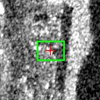 |  |

**detector_reasoning — 2023-07-02**

> Bright compact return located along the reef edge on the water side. Distinct from reef structure returns, showing point-like scattering consistent with a vessel hull. Positioned just off the reef margin.

**detector_reasoning — 2023-08-07**

> Moderately bright returns in a compact arrangement. Shape and intensity suggest a smaller vessel or vessel component. Less distinct than the primary detections but consistent with vessel backscatter characteristics.

**Human label:** `_____` (same / different / ambiguous)

**Notes:** 

---

## pair_02 — spatial 15.50 m, signature 0.261

- **Direct:** reject   |   **Signature (V1):** reject
- **2023-07-02 obs:** `umbra-2023-07-02-vlm-1688306455-1462-3340`
- **2023-08-07 obs:** `umbra-2023-08-07-vlm-1691416381-986-2183`
- **2023-07-02 lat/lon:** (8.853204, 114.661134)
- **2023-08-07 lat/lon:** (8.853298, 114.661239)
- **Bbox A (w x h):** 30 x 30 px,  conf=0.6
- **Bbox B (w x h):** 70 x 60 px,  conf=0.6
- **Chip size:** 128 x 128 px

| 2023-07-02 | 2023-08-07 |
|---|---|
| 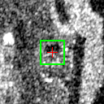 | 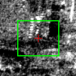 |

**detector_reasoning — 2023-07-02**

> Compact bright return near the water-reef interface at approximately (460, 310). Isolated bright point with higher backscatter than surrounding water, consistent with a small vessel or boat. Size and intensity suggest a smaller craft.

**detector_reasoning — 2023-08-07**

> Moderately bright returns in a compact arrangement. Shape and intensity suggest a smaller vessel or vessel component. Less distinct than the primary detections but consistent with vessel backscatter characteristics.

**Human label:** `_____` (same / different / ambiguous)

**Notes:** 

---

## pair_03 — spatial 18.51 m, signature 0.898

- **Direct:** reject   |   **Signature (V1):** reject
- **2023-07-02 obs:** `umbra-2023-07-02-vlm-1688306455-4087-2429`
- **2023-08-07 obs:** `umbra-2023-08-07-vlm-1691416381-2692-1557`
- **2023-07-02 lat/lon:** (8.857322, 114.668714)
- **2023-08-07 lat/lon:** (8.857309, 114.668882)
- **Bbox A (w x h):** 190 x 110 px,  conf=0.85
- **Bbox B (w x h):** 40 x 25 px,  conf=0.6
- **Chip size:** 240 x 240 px

| 2023-07-02 | 2023-08-07 |
|---|---|
|  | 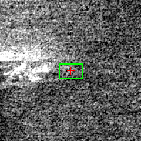 |

**detector_reasoning — 2023-07-02**

> Compact bright return cluster in upper-left corner with strong specular reflection characteristic of a metal vessel hull. The bright, concentrated scattering on dark water background is consistent with a ship's superstructure and deck equipment. Shape suggests a vessel oriented roughly diagonally.

**detector_reasoning — 2023-08-07**

> Secondary bright return cluster adjacent to the primary vessel return. Could represent a second smaller vessel moored nearby or a distinct superstructure element of the same vessel. The spatial separation and slight positional offset suggest it may be an independent target, possibly a smaller support vessel or tender alongside the larger ship.

**Human label:** `_____` (same / different / ambiguous)

**Notes:** 

---

## pair_04 — spatial 27.95 m, signature 0.413

- **Direct:** ACCEPT   |   **Signature (V1):** ACCEPT
- **2023-07-02 obs:** `umbra-2023-07-02-vlm-1688306455-1918-3554`
- **2023-08-07 obs:** `umbra-2023-08-07-vlm-1691416381-1202-2332`
- **2023-07-02 lat/lon:** (8.854692, 114.661595)
- **2023-08-07 lat/lon:** (8.854528, 114.661402)
- **Bbox A (w x h):** 85 x 50 px,  conf=0.6
- **Bbox B (w x h):** 55 x 70 px,  conf=0.6
- **Chip size:** 128 x 128 px

| 2023-07-02 | 2023-08-07 |
|---|---|
| 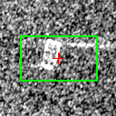 | 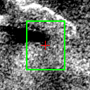 |

**detector_reasoning — 2023-07-02**

> Small compact bright rectangular return on dark water background in the left-center area. The brightness contrast against surrounding water and compact rectangular shape is consistent with a smaller vessel. Weaker return than vessels 1 and 2, suggesting a smaller craft.

**detector_reasoning — 2023-08-07**

> Bright compact return with associated darker shadow region in upper-left corner. The shape and intensity contrast suggest a large vessel or structure. Partial cutoff at image edge limits full assessment.

**Human label:** `_____` (same / different / ambiguous)

**Notes:** 

---

## pair_05 — spatial 28.12 m, signature 1.602

- **Direct:** reject   |   **Signature (V1):** reject
- **2023-07-02 obs:** `umbra-2023-07-02-vlm-1688306455-1783-3626`
- **2023-08-07 obs:** `umbra-2023-08-07-vlm-1691416381-1202-2332`
- **2023-07-02 lat/lon:** (8.854533, 114.661146)
- **2023-08-07 lat/lon:** (8.854528, 114.661402)
- **Bbox A (w x h):** 340 x 110 px,  conf=0.85
- **Bbox B (w x h):** 55 x 70 px,  conf=0.6
- **Chip size:** 384 x 384 px

| 2023-07-02 | 2023-08-07 |
|---|---|
|  | 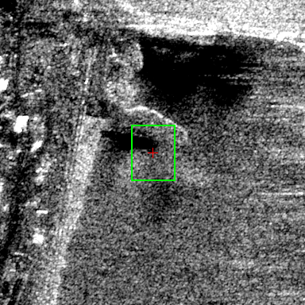 |

**detector_reasoning — 2023-07-02**

> Large, highly bright elongated return in the upper-left portion of the image with strong specular reflection characteristic of a large metal vessel. The intense brightness and elongated structure along with what appears to be azimuth smearing/wake streak extending diagonally is consistent with a large ship (likely a coast guard or navy vessel given the reef context). The horizontal streak trailing from it is classic azimuth smearing of a moving or stationary large metallic target.

**detector_reasoning — 2023-08-07**

> Bright compact return with associated darker shadow region in upper-left corner. The shape and intensity contrast suggest a large vessel or structure. Partial cutoff at image edge limits full assessment.

**Human label:** `_____` (same / different / ambiguous)

**Notes:** 

---

## pair_06 — spatial 29.52 m, signature 1.096

- **Direct:** ACCEPT   |   **Signature (V1):** reject
- **2023-07-02 obs:** `umbra-2023-07-02-vlm-1688306455-1783-3626`
- **2023-08-07 obs:** `umbra-2023-08-07-vlm-1691416381-1116-2396`
- **2023-07-02 lat/lon:** (8.854533, 114.661146)
- **2023-08-07 lat/lon:** (8.854431, 114.660898)
- **Bbox A (w x h):** 340 x 110 px,  conf=0.85
- **Bbox B (w x h):** 185 x 200 px,  conf=0.6
- **Chip size:** 384 x 384 px

| 2023-07-02 | 2023-08-07 |
|---|---|
| 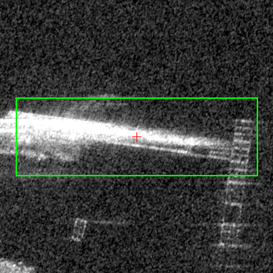 | 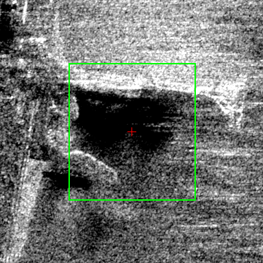 |

**detector_reasoning — 2023-07-02**

> Large, highly bright elongated return in the upper-left portion of the image with strong specular reflection characteristic of a large metal vessel. The intense brightness and elongated structure along with what appears to be azimuth smearing/wake streak extending diagonally is consistent with a large ship (likely a coast guard or navy vessel given the reef context). The horizontal streak trailing from it is classic azimuth smearing of a moving or stationary large metallic target.

**detector_reasoning — 2023-08-07**

> Large bright return with irregular but structured edges visible in lower-left corner. The bright white linear edges and dark interior suggest a large vessel or multiple vessels moored near/on the reef structure. The sharp bright returns along the upper edge (around y~460-490, x~50-200) are consistent with vessel superstructure returns rather than purely reef backscatter.

**Human label:** `_____` (same / different / ambiguous)

**Notes:** 

---

## pair_07 — spatial 29.77 m, signature 0.807

- **Direct:** reject   |   **Signature (V1):** reject
- **2023-07-02 obs:** `umbra-2023-07-02-vlm-1688306455-1582-3380`
- **2023-08-07 obs:** `umbra-2023-08-07-vlm-1691416381-986-2183`
- **2023-07-02 lat/lon:** (8.853562, 114.661293)
- **2023-08-07 lat/lon:** (8.853298, 114.661239)
- **Bbox A (w x h):** 140 x 30 px,  conf=0.85
- **Bbox B (w x h):** 70 x 60 px,  conf=0.6
- **Chip size:** 176 x 176 px

| 2023-07-02 | 2023-08-07 |
|---|---|
|  | 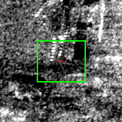 |

**detector_reasoning — 2023-07-02**

> Bright elongated return with strong specular reflection characteristic of a metal vessel hull. The horizontal streak extending to the right (~430-570 pixels) is consistent with azimuth smearing of a moving or stationary vessel. Located on the water side of the reef boundary. The bright point target with trailing smear is a classic SAR vessel signature.

**detector_reasoning — 2023-08-07**

> Moderately bright returns in a compact arrangement. Shape and intensity suggest a smaller vessel or vessel component. Less distinct than the primary detections but consistent with vessel backscatter characteristics.

**Human label:** `_____` (same / different / ambiguous)

**Notes:** 

---

## pair_08 — spatial 30.49 m, signature 0.595

- **Direct:** ACCEPT   |   **Signature (V1):** ACCEPT
- **2023-07-02 obs:** `umbra-2023-07-02-vlm-1688306455-3252-2669`
- **2023-08-07 obs:** `umbra-2023-08-07-vlm-1691416381-2183-1737`
- **2023-07-02 lat/lon:** (8.855910, 114.666419)
- **2023-08-07 lat/lon:** (8.856092, 114.666626)
- **Bbox A (w x h):** 70 x 35 px,  conf=0.6
- **Bbox B (w x h):** 110 x 110 px,  conf=0.85
- **Chip size:** 144 x 144 px

| 2023-07-02 | 2023-08-07 |
|---|---|
| 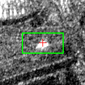 | 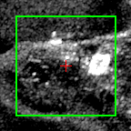 |

**detector_reasoning — 2023-07-02**

> Isolated bright compact return on what appears to be water/reef edge area. Brightness and compactness are consistent with a vessel, though proximity to reef structure introduces some ambiguity.

**detector_reasoning — 2023-08-07**

> Compact bright return visible in the lower-right portion of the image with high radar cross-section consistent with a metal vessel hull. The bright specular return with surrounding darker water background is characteristic of a ship target in SAR imagery. A wake/smear signature extends toward the lower-left, consistent with azimuth smearing of a vessel on water.

**Human label:** `_____` (same / different / ambiguous)

**Notes:** 

---

## pair_09 — spatial 31.45 m, signature 1.324

- **Direct:** ACCEPT   |   **Signature (V1):** reject
- **2023-07-02 obs:** `umbra-2023-07-02-vlm-1688306455-4184-2749`
- **2023-08-07 obs:** `umbra-2023-08-07-vlm-1691416381-2769-1843`
- **2023-07-02 lat/lon:** (8.858209, 114.668181)
- **2023-08-07 lat/lon:** (8.858487, 114.668118)
- **Bbox A (w x h):** 230 x 195 px,  conf=0.85
- **Bbox B (w x h):** 60 x 20 px,  conf=0.6
- **Chip size:** 288 x 288 px

| 2023-07-02 | 2023-08-07 |
|---|---|
| 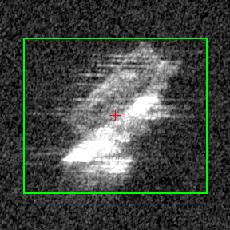 | 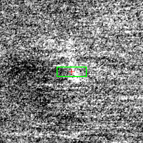 |

**detector_reasoning — 2023-07-02**

> Elongated bright return in upper-right area with characteristic horizontal azimuth smearing streaks extending to the left, which is a classic SAR signature of a moving vessel (velocity-induced azimuth displacement). The bright core represents the vessel hull/superstructure, and the horizontal streaking indicates the target was in motion during acquisition. Shape and size consistent with a medium-to-large vessel (likely a coast guard or fishing vessel ~60-100m in length given the 0.25m/pixel resolution).

**detector_reasoning — 2023-08-07**

> Elongated bright return in the lower-left area of the image with a slight horizontal smearing pattern. The linear bright streak is consistent with azimuth smearing of a moving vessel. The orientation and intensity suggest a ship wake or vessel with motion-induced smearing typical in SAR imagery.

**Human label:** `_____` (same / different / ambiguous)

**Notes:** 

---

## pair_10 — spatial 33.24 m, signature 1.363

- **Direct:** ACCEPT   |   **Signature (V1):** reject
- **2023-07-02 obs:** `umbra-2023-07-02-vlm-1688306455-2889-2594`
- **2023-08-07 obs:** `umbra-2023-08-07-vlm-1691416381-1938-1657`
- **2023-07-02 lat/lon:** (8.854922, 114.665832)
- **2023-08-07 lat/lon:** (8.854978, 114.666129)
- **Bbox A (w x h):** 140 x 110 px,  conf=0.85
- **Bbox B (w x h):** 270 x 340 px,  conf=0.6
- **Chip size:** 384 x 384 px

| 2023-07-02 | 2023-08-07 |
|---|---|
| 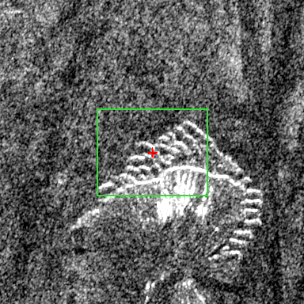 | 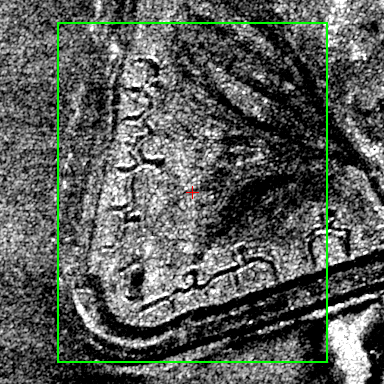 |

**detector_reasoning — 2023-07-02**

> Bright, structured return visible at bottom-center of image. Shows characteristic vessel signature with multiple high-intensity point scatterers arranged in a pattern consistent with ship superstructure. The bright white returns with organized internal structure distinguish it from random sea clutter. Appears to be a moderately sized vessel, possibly a fishing or coast guard vessel given the location at Whitsun Reef.

**detector_reasoning — 2023-08-07**

> Large structure in the upper-right corner with complex bright returns and structured edges. The curved lines and high-backscatter features suggest a reef platform or anchored vessel/barge structure. The scale and structured geometry with strong corner reflector-like returns are consistent with a large moored vessel or semi-permanent maritime structure (likely a Chinese maritime militia vessel or coast guard ship moored at Whitsun Reef). The curved bright lines may represent the hull edges and superstructure.

**Human label:** `_____` (same / different / ambiguous)

**Notes:** 

---

## pair_11 — spatial 35.68 m, signature 0.636

- **Direct:** ACCEPT   |   **Signature (V1):** ACCEPT
- **2023-07-02 obs:** `umbra-2023-07-02-vlm-1688306455-4966-2048`
- **2023-08-07 obs:** `umbra-2023-08-07-vlm-1691416381-3175-1332`
- **2023-07-02 lat/lon:** (8.858541, 114.671426)
- **2023-08-07 lat/lon:** (8.858295, 114.671216)
- **Bbox A (w x h):** 100 x 55 px,  conf=0.85
- **Bbox B (w x h):** 50 x 80 px,  conf=0.6
- **Chip size:** 128 x 128 px

| 2023-07-02 | 2023-08-07 |
|---|---|
| 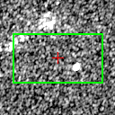 | 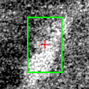 |

**detector_reasoning — 2023-07-02**

> Bright point-like to elongated return in upper-center area of the bright feature cluster. Compact bright SAR return consistent with metal vessel hull. Shows characteristic bright spot response against dark water background.

**detector_reasoning — 2023-08-07**

> Compact bright elongated return visible against darker water background, oriented roughly north-south. The bright specular return is consistent with a vessel hull/superstructure in SAR imagery. Shape and size (~50x80 pixels at 0.25m/pixel ≈ 12x20m) consistent with a small-to-medium vessel.

**Human label:** `_____` (same / different / ambiguous)

**Notes:** 

---

## pair_12 — spatial 41.07 m, signature 0.913

- **Direct:** ACCEPT   |   **Signature (V1):** reject
- **2023-07-02 obs:** `umbra-2023-07-02-vlm-1688306455-4021-2454`
- **2023-08-07 obs:** `umbra-2023-08-07-vlm-1691416381-2692-1557`
- **2023-07-02 lat/lon:** (8.857222, 114.668519)
- **2023-08-07 lat/lon:** (8.857309, 114.668882)
- **Bbox A (w x h):** 200 x 90 px,  conf=0.85
- **Bbox B (w x h):** 40 x 25 px,  conf=0.6
- **Chip size:** 240 x 240 px

| 2023-07-02 | 2023-08-07 |
|---|---|
| 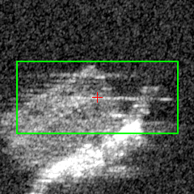 |  |

**detector_reasoning — 2023-07-02**

> Isolated bright compact return in the lower-left area of the image on open water, well separated from the reef. Shows horizontal azimuth smearing streaks extending left/right, which is a classic SAR signature of a moving vessel. The elongated bright streak pattern is consistent with a ship underway with azimuth smearing due to target motion.

**detector_reasoning — 2023-08-07**

> Secondary bright return cluster adjacent to the primary vessel return. Could represent a second smaller vessel moored nearby or a distinct superstructure element of the same vessel. The spatial separation and slight positional offset suggest it may be an independent target, possibly a smaller support vessel or tender alongside the larger ship.

**Human label:** `_____` (same / different / ambiguous)

**Notes:** 

---

## pair_13 — spatial 46.78 m, signature 0.678

- **Direct:** reject   |   **Signature (V1):** reject
- **2023-07-02 obs:** `umbra-2023-07-02-vlm-1688306455-4988-1993`
- **2023-08-07 obs:** `umbra-2023-08-07-vlm-1691416381-3175-1332`
- **2023-07-02 lat/lon:** (8.858479, 114.671599)
- **2023-08-07 lat/lon:** (8.858295, 114.671216)
- **Bbox A (w x h):** 90 x 40 px,  conf=0.6
- **Bbox B (w x h):** 50 x 80 px,  conf=0.6
- **Chip size:** 128 x 128 px

| 2023-07-02 | 2023-08-07 |
|---|---|
| 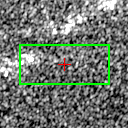 |  |

**detector_reasoning — 2023-07-02**

> Intermediate bright return connecting the upper and lower bright clusters, possibly a vessel or the wake/smearing artifact between two closely spaced vessels. The brightness level exceeds background noise suggesting a real scatterer.

**detector_reasoning — 2023-08-07**

> Compact bright elongated return visible against darker water background, oriented roughly north-south. The bright specular return is consistent with a vessel hull/superstructure in SAR imagery. Shape and size (~50x80 pixels at 0.25m/pixel ≈ 12x20m) consistent with a small-to-medium vessel.

**Human label:** `_____` (same / different / ambiguous)

**Notes:** 

---

## pair_14 — spatial 48.72 m, signature 0.454

- **Direct:** ACCEPT   |   **Signature (V1):** ACCEPT
- **2023-07-02 obs:** `umbra-2023-07-02-vlm-1688306455-4087-2429`
- **2023-08-07 obs:** `umbra-2023-08-07-vlm-1691416381-2674-1492`
- **2023-07-02 lat/lon:** (8.857322, 114.668714)
- **2023-08-07 lat/lon:** (8.857041, 114.669056)
- **Bbox A (w x h):** 190 x 110 px,  conf=0.85
- **Bbox B (w x h):** 140 x 50 px,  conf=0.85
- **Chip size:** 240 x 240 px

| 2023-07-02 | 2023-08-07 |
|---|---|
| 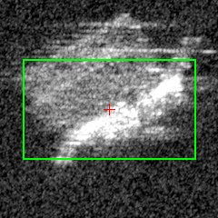 | 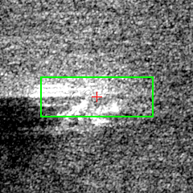 |

**detector_reasoning — 2023-07-02**

> Compact bright return cluster in upper-left corner with strong specular reflection characteristic of a metal vessel hull. The bright, concentrated scattering on dark water background is consistent with a ship's superstructure and deck equipment. Shape suggests a vessel oriented roughly diagonally.

**detector_reasoning — 2023-08-07**

> Bright, compact elongated return characteristic of a large vessel hull. Strong specular reflection consistent with metal superstructure. Located at approximately center-left of image with associated azimuth smearing/wake streaks extending horizontally in both directions, which is a classic SAR signature of a ship on water. The dark shadow region to the lower-left is consistent with radar shadow cast by a large vessel structure.

**Human label:** `_____` (same / different / ambiguous)

**Notes:** 

---
